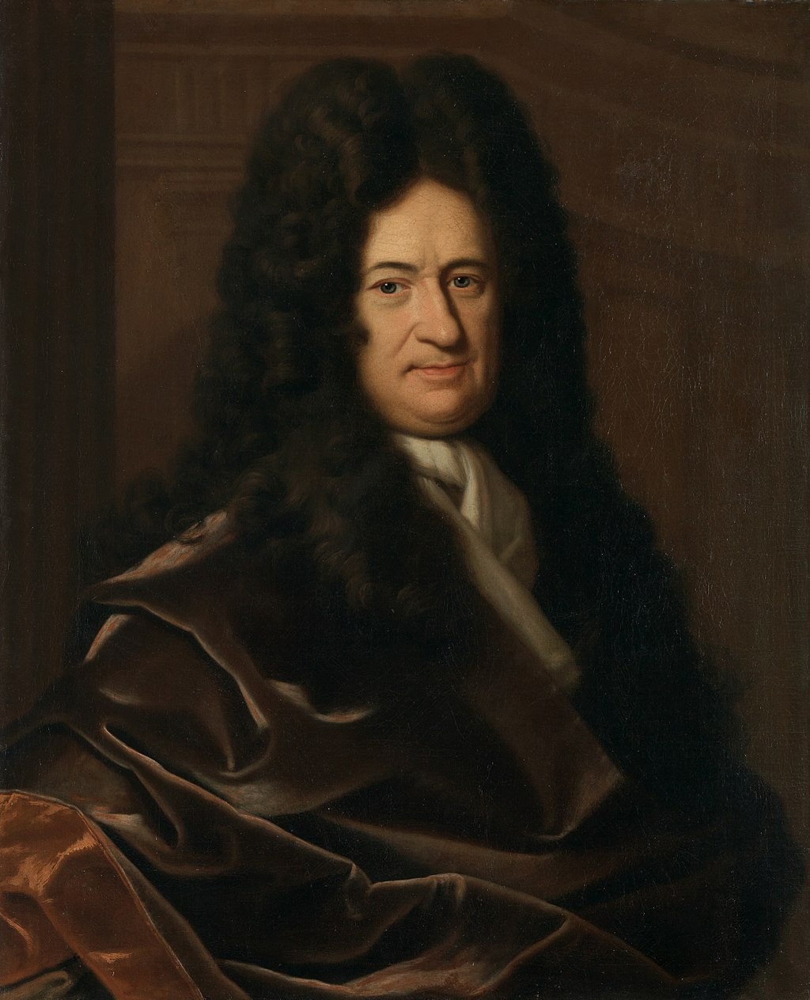
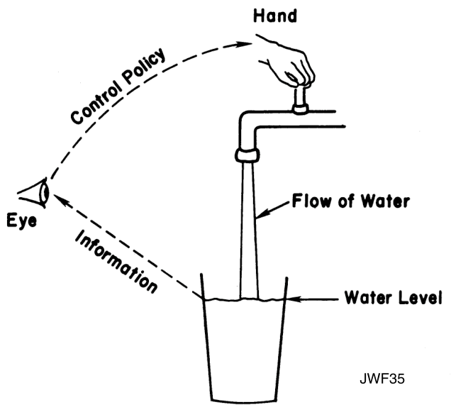
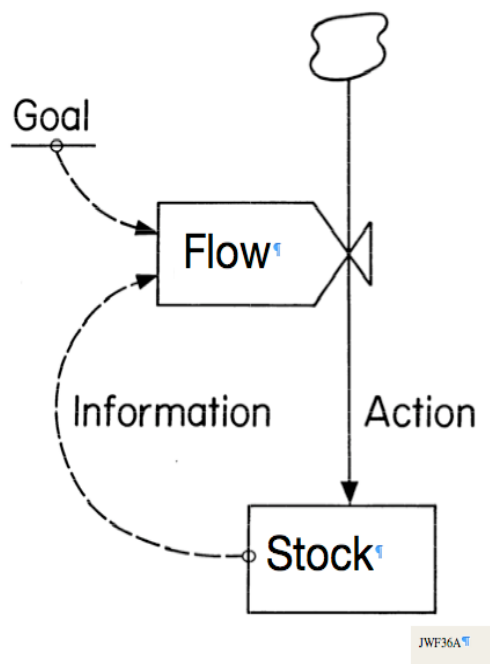

class: center, middle, title-slide

background-image: url("img/water-light.jpg")

<!-- Own title slide / -->

# Numerical simulation of dynamic systems with R: an introduction

## Thomas Petzoldt and Karline Soetaert


### IMPORTANT NOTE

This slide set is work in progress and currently at a very early stage of development.
It works with **Chrome** and recent versions of **Edge**, wheres scrolling may have problems with Firefox.

For the time being, please consult https://desolve-r-forge.r-project.org

### `r Sys.Date()`

```{r setup, include=FALSE}
knitr::opts_chunk$set(echo = FALSE)
library("dplyr")
library("tidyr")
library("kableExtra")
library("DiagrammeR")
library("deSolve")
library("rootSolve")
mypar <- list(las=1, cex.lab=1.4, cex.axis=1.4, lwd=2)
```

<!-- citations work differently with xaringan compared to @Markdown / -->
```{r, load_refs, include=FALSE, cache=FALSE}
library("RefManageR")
BibOptions(check.entries = FALSE,
           bib.style = "authoryear",
           cite.style = "authoryear",
           style = "markdown",
           dashed = FALSE)
bib <- ReadBib("./bib.bib", check = FALSE)
```

---


## Preface


Dynamical systems are found everywhere, in mathematics, physics, chemistry, engineering and business - ecology and aquatic sciences are no exception.

One common approach to describe such systems is by means of differential equations. Following the ideas of Forrester, differential equations appear quite naturally if we describe changes in a system in terms of growth and decay, which together make up a mass balance. A somewhat bigger challenge is to solve these differential equations - some of us may still remember the challenges of differential calculus in high school courses.

Fortunately, computer algorithms allow to solve even complex differential equation systems numerically. This has opened a world of practical applications to be accessible for anyone that has a basic knowledge in scientific computing, or is willing to acquire this knowledge. R is such a scientific computing language that offers powerful methods to solve differential equations. Moreover, some R-packages are especially designed to also solve spatially variable problems that are often found of importance in aquatic sciences.

The introduction will demonstrate selected examples: growth of organisms, predator-prey interaction, spread of diseases, and transport-reaction problems. The formulation of such models in R can be surprisingly compact and close to the mathematical equations. 

---

class: scrollable-slide

## Dynamical System


* In mathematics, a system in which a function describes the time dependence of a point in a geometrical space.
* Examples include models that describe the swinging of a clock pendulum, the flow of water in a pipe, and the number of fish each springtime in a lake.
* The state of a dynamical system at a given time is a vector of real numbers, a point in state space. 
* The evolution rule is a function that describes what future states follow from the current state.<sup>[1]</sup>


### Different ways of description

* statistical approach: time series of state variables (pools)
* dynamic approach: description of changes
    * automata in discrete time: IBMs, ABMs, cellular automata
    * equations in discrete time: difference equations
    * equations in continuous time: differential equations (ODEs)

A dynamical system can be described deterministically or stochastically. 

We focus on the **deterministic** description in **continuous** time
with numerically solved differential equations.

[1] Wikipedia, [Dynamical_system](https://en.wikipedia.org/wiki/Dynamical_system)
---

class: scrollable-slide

## Differential Calculus

.pull-left[

$\dot{y} = k \cdot y$


Isaac Newton, 1643 - 1727
]

.pull-right[

$\frac{dy}{dx} = k \cdot y$



Gottfried Wilhelm Leibniz, 1646 - 1716


]

---

## Jay W. Forrester: System Dynamics


.pull-left[



]


.pull-right[



]

* thinking in feedback loops
* easy to understand, if we think in pools and changes

From: [Forrester, J.W. (2009) Some Basic Concepts in System Dynamics](https://www.cc.gatech.edu/classes/AY2018/cs8803cc_spring/research_papers/Forrester-SystemDynamics.pdf)

---

## Dynamic systems: how and why?


"Many believe that system dynamics has helped them become skilled at
inventing the future, either by sketching out causal loops on the back of
an envelope, or by assembling equations of cause and effect in a
computer model. Both approaches work." (J.W.F, 1995)


.pull-left[
#### Let’s speak about computers
- continous time $\rightarrow$ differential equations
- discrete time: another interesting story ...

.center[

]
]    

.pull-right[
#### Why numerical integration?
* Not all systems have an analytical solution.
* Numerical solutions allow discrete input.    

"... students can deal with high-order dynamic systems
without ever discovering that their elders consider such to be very difficult."
J.W. Forrester 2009.
]


---

## Import and Export

$${
\frac{dX}{dt} = \mbox{import} - \mbox{export}\\
}$$

```{r echo=FALSE, fig.width=12, fig.height=4}
grViz("digraph feedback {
         graph [rankdir = 'LR']
           node [shape = box, penwidth=2, fontname = 'Helvetica']
             Matter
           node [shape = octagon, penwidth=0.5, style='rounded', fixedsize=25, fontsize=8]
             Source Sink
           node [shape = none, fontsize=10]
             import export
           edge [penwidth=1.5]
             Source -> import -> Matter -> export -> Sink
         
}")
```


---

## Exponential Growth

$${\frac{dN}{dt} = \mbox{birth} - \mbox{death}\\
\frac{dN}{dt} = \mbox{birthhrate} \cdot N - \mbox{deathrate}\cdot N\\
\frac{dN}{dt} = b \cdot N - d \cdot N = (b-d) \cdot N = r \cdot N\\
}$$
```{r echo=FALSE, fig.width=12, fig.height=4}
grViz("digraph feedback {
         graph [rankdir = 'LR']
           node [shape = box, penwidth=2, fontname = 'Helvetica']
             Population
           node [shape = octagon, penwidth=0.5, style='rounded', fixedsize=25, fontsize=8]
             Source Sink
           node [shape = none, fontsize=10]
             birth death
           edge [penwidth=1.5]
             Source -> birth -> Population -> death -> Sink
           edge [penwidth=0.7, tailport = 'n', headport = 'n', constraint = false, color=tomato]
             Population -> birth 
             Population -> death
}")
```


---

## Analytical Integration and the Euler Method


* analytical integration
* stepwise solution with R = Euler's method
* problem of the explicit forward method: integration error

---

## Numerical Integration with deSolve: the naive way

* package **deSolve** `r Citep(bib, "deSolve_jss")` provides all necessary tools and supports
a consistent workflow:

* define the model as a function
* use ode
* use plot

---

## Runge-Kutta, ODEPACK, deSolve, part I


* approaches to resolve the integration error
* additional time steps and use of polynomials: RK-Methods
    * more precise, but precision depends on pre-defined time step
    * problem: either not precise enough or too much work
    * danger of instability
    * optimum time step can vary over time
    * stiff systems: some states change faster than others
* adaptive step size, guaranteed precision
    * different ways to appraoch this
    * combination of two RK methods
    * iteration methods, e.g. Adams or BDF
    * lsoda: switches between Adams (for stiff) and BDF (for non-stiff) regions
    

---

## Resource Limited Growth


* algae and phosphorus
* stoichiometry, package marelac
* functional response

---

## SIR and the Covid 19 Pandemic


* similar to resource-limited growth
* show atol, rtol and rescaling of problems

---

## External Interventions


* implementation of forcings
* plotting of scenarios

---

## Back to Lake Modelling: The Chemostat


* inflow and outflow
* numerical solution
* equilibrium
* rootSolve and analytical solution of equlibrium

---

## The Chemostat Code

.scrollable[

```{r echo=TRUE}
library("deSolve")
library("rootSolve")

chemostat <- function(time, init, parms) {
  with(as.list(c(init, parms)), {
    mu   <- mumax * P/(kp + P)  # Monod equation
    dAlg <- mu * Alg - D * Alg
    dP   <-  D *(P0 - P) - 1/Y * mu * Alg
    list(c(dAlg, dP), mu=mu)
   })
}
parms <- c(
  mumax = 0.5,    # 1/d
  kp    = 0.01,   # half saturation constant (mg/L)
  Y     = 41,     # yield coefficient (stoichiometric C:P ratio)
  D     = 0.1,    # 1/d
  P0    = 0.05    # P in inflow (mg/L)
)
times <- seq(0, 40, 0.1)  # (d)
init  <- c(Alg=0.01, P=0.05) # Phytoplankton C and Phosphorus P (mg/L)

## =============================================================================
## Dynamic simulation
## =============================================================================
out <- ode(init, times, chemostat, parms)
plot(out)

## =============================================================================
## Steady state solution
## =============================================================================
state <- data.frame(
  D = seq(0, 0.6, length.out = 100),
  X = 0,
  S = 0
)

for (i in 1:nrow(state)) {
  parms["D"] <- state$D[i]
  times <- c(0, Inf)
  out <- runsteady(init, times, chemostat, parms)
  state[i, 2:3] <- out$y
}

par(mfrow = c(3, 1))
plot(S ~ D, data = state, type = "l")
plot(X ~ D, data = state, type = "l")
plot(S * X ~ D, data = state, type = "l")
```
]

---

## Interaction Between Populations: Lotka-Volterra's Predator and Prey


* state diagram, cycles
* damped cycle if we introduce a Monod term

---

## Efficient Model Formulation in Matrix Style


* multi-species predator-prey model

---

## PDE's in 1D: Transport in a River


* package ReacTran
* uses also matrix formulation
* plot3D example

---

## Outlook


* some bigger applications
* rodeo package
* shiny

---

## Appendices


Things that should be mentioned somewhere, but not yet in the introductory
lecture

* Solver functions in deSolve
* C and Fortran interface
* Karline's books
* Online resources: R-Forge, CRAN-Taskview, publications


---

## Copyright


This resource was created by [tpetzoldt](github.com/tpetzoldt) and 
[karlines](https://github.com/karlines). It is provided 
as is without warranty.

---

## Bibliography

.scrollable[
```{r refs, echo=FALSE, results="asis"}
PrintBibliography(bib)
```
]
