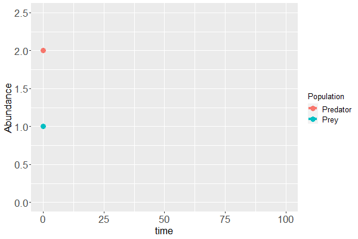
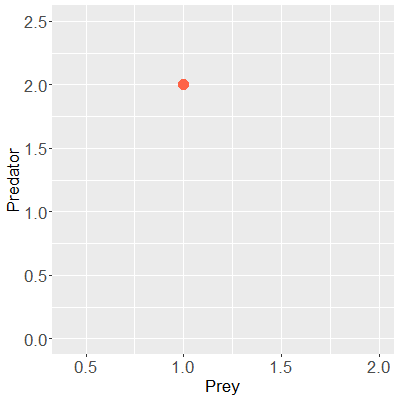
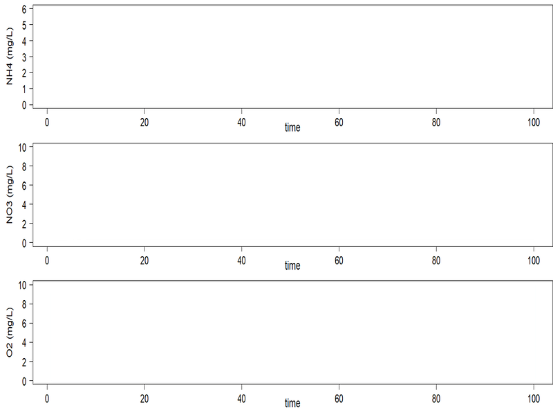
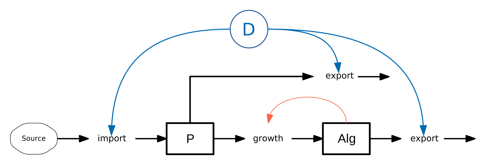

class: center, middle, title-slide

background-image: url("img/water_tud_nioz_r_oer_by.png")

background-size: cover


<!-- Own title slide / -->

# Numerical simulation of dynamic systems with R: an introduction

#### Thomas Petzoldt and Karline Soetaert,  `r Sys.Date()`

#### IMPORTANT NOTE

This slide set is work in progress and still at an **early stage of development**.

The name of the repo points to an upcoming workshop about open data in aquatic sciences https://aquaticdatasciopensci.github.io/ in July 2021.

The [source code](https://github.com/dynamic-R/hacking-limnology) is freely available.


```{r setup, include=FALSE}
knitr::opts_chunk$set(echo = FALSE, fig.width=14, 
                      fig.height=6, dev.args = list(pointsize=20))
library("dplyr")
library("tidyr")
library("kableExtra")
library("DiagrammeR")
library("deSolve")
library("rootSolve")
library("marelac")
mypar <- list(las = 1, cex.lab = 1.4, cex.axis=1.4, lwd = 2)
```

```{r xaringan-themer, include=FALSE, warning=FALSE}
library("xaringanthemer")
style_mono_light(
  title_slide_text_color = "#00305d",
  link_color = "#006ab2"#,
  #white_color = "#FFFFFF"
)
```

```{r xaringanExtra, include=FALSE, warnint=FALSE}
#library("xaringanExtra")
xaringanExtra::use_webcam()
xaringanExtra::use_tile_view()
#xaringanExtra::use_scribble()
#xaringanExtra::use_freezeframe()
#xaringanExtra::use_progress_bar(color = "#0051BA", location = "top")
```

<!-- citations work differently with xaringan compared to @Markdown / -->
```{r, load_refs, include=FALSE, cache=FALSE}
library("RefManageR")
BibOptions(check.entries = FALSE,
           bib.style = "authoryear",
           cite.style = "authoryear",
           style = "markdown",
           dashed = FALSE)
bib <- ReadBib("./bib.bib", check = FALSE)
```

---


## Summary


Dynamical systems are found everywhere, in mathematics, physics, chemistry, engineering and business - ecology and aquatic sciences are no exception.

One common approach to describe such systems is by means of differential equations. Following the ideas of Forrester, differential equations appear quite naturally if we describe changes in a system in terms of growth and decay, which together make up a mass balance. A somewhat bigger challenge is to solve these differential equations - some of us may still remember the challenges of differential calculus in high school courses.

Fortunately, computer algorithms allow to solve even complex differential equation systems numerically. This has opened a world of practical applications to be accessible for anyone that has a basic knowledge in scientific computing, or is willing to acquire this knowledge. R is such a scientific computing language that offers powerful methods to solve differential equations. Moreover, some R-packages are especially designed to also solve spatially variable problems that are often found of importance in aquatic sciences.

The introduction will demonstrate selected examples: growth of organisms, predator-prey interaction, spread of diseases, and transport-reaction problems. The formulation of such models in R can be surprisingly compact and close to the mathematical equations. 

---

### Example 1: Predator-Prey model



---

### Example 2: Nitrification in a River (1D)
.center[

]
---

#### Example 3: SIR model - Flatten the curve

<iframe src="https://weblab.hydro.tu-dresden.de/apps/sir-app/" width=1200px, height=600px></iframe>

---

### Example 4: Epidemiological Model in 2D

.center[

]


---
class: page-font-large

## Dynamical System<sup>.gray[*</sup>]

* In **mathematics**: time dependence of points in geometrical space.
* **Examples:** 
    - clock pendulum 
    - flow of water in a pipe
    - number of fish each springtime in a lake
* **State** at a given time:
    - vector of real numbers
    - point in state space
* **Evolution rule:** 
    - function that describes <span style="color: blue;"> what future states follow from the current state </span>


.gray[*) Wikipedia, [Dynamical_system](https://en.wikipedia.org/wiki/Dynamical_system)]


---
class: page-font-large

### Different ways of description


* statistical approach: time series of state variables (pools)

* dynamic approach: description of changes

    * automata in discrete time: IBMs, ABMs, cellular automata
    * equations in discrete time: difference equations
    * equations in continuous time: differential equations (ODEs)

A dynamical system can be described deterministically or stochastically. 

We focus on the:
* .blue[**deterministic**] description in 
* .blue[**continuous time**] with 
* .blue[numerically solved differential equations].


---

class: scrollable-slide

## Differential Calculus

.pull-left[

$\dot{y} = k \cdot y$


Isaac Newton, 1643 - 1727
]

.pull-right[

$\frac{dy}{dx} = k \cdot y$


Gottfried Wilhelm Leibniz, 1646 - 1716


]

---

## Jay W. Forrester: System Dynamics


.pull-left[


]


.pull-right[


]

* thinking in feedback loops
* easy to understand, if we think in pools and changes

From: [Forrester, J.W. (2009) Some Basic Concepts in System Dynamics](https://www.cc.gatech.edu/classes/AY2018/cs8803cc_spring/research_papers/Forrester-SystemDynamics.pdf)

---
class: page-font-huge

## Dynamic systems: how and why?


"Many believe that system dynamics has helped them become skilled at
inventing the future, either by sketching out causal loops on the back of
an envelope, or by assembling equations of cause and effect in a
computer model. Both approaches work."

.small[.blue[(J. W. Forrester, 1995)]]
---
class: page-font-large

## Dynamic systems: how and why?


.pull-left[
#### Let’s speak about computers:
- continous time <br> $\rightarrow$ differential equations

- discrete time: <br> another interesting story ...

.center[

]
]    

.pull-right[
#### Why numerical integration?
* Not all systems <br> have an analytical solution.

* Numerical solutions <br> allow discrete input.    

"... students can deal with high-order dynamic systems
without ever discovering that their elders consider such to be very difficult."<br>
.small[.gray[J. W. Forrester 2009]]
]


---
class: page-font-large

## Import and Export

$${
\frac{dX}{dt} = \mbox{import} - \mbox{export}\\
}$$

```{r diag-im-ex, echo=FALSE, fig.height=4}
grViz("digraph feedback {
         graph [rankdir = 'LR', bgcolor='none']
           node [shape = box, penwidth=2, fontname = 'Helvetica']
             X
           node [shape = octagon, penwidth=0.5, style='rounded', fixedsize=25, fontsize=8]
             Source Sink
           node [shape = none, fontsize=10]
             import export
           edge [penwidth=1.5]
             Source -> import -> X -> export -> Sink
         
}")
```

$X$ = .gray[any quantity: matter, energy, information]

---

## Exponential Growth

$${\frac{dN}{dt} = \mbox{birth} - \mbox{death}\\
\frac{dN}{dt} = \mbox{birthhrate} \cdot N - \mbox{deathrate}\cdot N = b \cdot N - d \cdot N = (b-d) \cdot N \\
\frac{dN}{dt} = r \cdot N\\
}$$
```{r echo=FALSE, fig.height=4}
grViz("digraph feedback {
         graph [rankdir = 'LR', bgcolor='none']
           node [shape = box, penwidth=2, fontname = 'Helvetica']
             'Population N'
           node [shape = octagon, penwidth=0.5, style='rounded', fixedsize=25, fontsize=8]
             Source Sink
           node [shape = none, fontsize=10]
             birth death
           edge [penwidth=1.5]
             Source -> birth -> 'Population N' -> death -> Sink
           edge [penwidth=0.7, tailport = 'n', headport = 'n', constraint = false, color=tomato]
             'Population N' -> birth 
             'Population N' -> death
}")
```


---

## Analytical Integration


.pull-left[
```{r expgrowth, echo=FALSE, fig.height=4, fig.width=10}
par(mar=c(2.5, 5, 0.5, 1)+.1, las = 1, lwd = 2)
r    <- 0.5
N0   <- 10
dt   <- 0.1
time <- seq(0, 10, dt)
N <- N0 * exp(r * time)
plot(time, N, type="l", xlab="", ylim=c(0, 1500))
mtext("time", 1, 1.5)
```
```r
r    <- 0.5
N0   <- 10
dt   <- 0.1
time <- seq(0, 10, dt)

N <- N0 * exp(r * time)
plot(time, N, type="l")
```
]

.pull-right[
\begin{align}
\frac{dN}{dt} &= r\cdot N\\
\int_0^t \frac{dN}{dt} &= \int_0^t r\cdot N\\
\int_0^t \frac{1}{N} dN &= \int_0^t r dt\\
\ln(N) &= rt + c\\
N_t &= N_0 e^{rt}\\
\end{align}

<br></br>

* Integral calculus = "Gold Standard" ...
* ... but not always possible
]

---

## Numerical Integration with the Euler Method


.pull-left[

```{r expgrowth-euler, echo=FALSE, fig.height=4, fig.width=10}
par(mar=c(2.5, 5, 0.5, 1)+.1, las = 1, lwd = 2)
N <- numeric(length(time))

N[1] <- N0
for (i in 2:length(time)) {
  N[i] <- N[i-1] + r * N[i-1] * dt
}
plot(time, N, type = "l", lty="solid", col="red", xlab="", ylim=c(0, 1500))
N <- N0 * exp(r * time)
lines(time, N, lty="solid")
mtext("time", 1, 1.5)
legend("topleft", c("analytical", "Euler"), col=c("black", "red"), lty=1)
```


```{r echo=TRUE, eval=FALSE}
N <- numeric(length(time))

N[1] <- N0
for (i in 2:length(time)) {
  N[i] <- N[i-1] + r * N[i-1] * dt
}
plot(time, N, type = "l", col = "red")
```
]

.pull-right[
\begin{align}
\frac{dN}{dt} &= r\cdot N\\
\frac{\Delta N}{\Delta t} &= r\cdot N\\
N_t &= N_{t-1} + r\cdot N_{t-1}
\end{align}

<br></br>

.page-font-large[
* .red[approximation <br> with discrete time step]
* differential equation <br> $\rightarrow$ difference equation
* easy, but integration error
]
]

---

### Numerical Integration Made Easy with deSolve

.pull-left[
#### Logistic growth

<span style="background: #ffff88;">
$\frac{dN}{dt} = rN(1-N/K)$
</span>


#### Model formulation close to mathematical notation

```{r, ode-naive, eval=FALSE, echo=TRUE}
library("deSolve")
model <- function (time, y, parms) {
  with(as.list(c(y, parms)), {
   {{dN_dt <- r * N * (1 - N / K)}}
    list(c(dN_dt))
  })
}
y0 <- c(N = 0.1)
parms <- c(r = 0.1, K = 10)
times <- seq(from = 0, to = 100, by = 1)
```
]

.pull-right[
#### Solve with `ode`

```{r, echo=TRUE, eval=FALSE}
out <- ode(y0, times, model, parms)
plot(out)
```


```{r, ode-naive2, eval=TRUE, echo=FALSE, fig.width=10, fig.height=6}
par(las = 1, mar=c(2.5,3,1.5,1)+.1, lwd = 2)
library("deSolve")
model <- function (time, y, parms) {
  with(as.list(c(y, parms)), {
    dN_dt <- r * N * (1 - N / K)
    list(c(dN_dt))
  })
}
y0 <- c(N = 0.1)
parms <- c(r = 0.1, K = 10)
times <- seq(from = 0, to = 100, by = 1)
out <- ode(y0, times, model, parms)
plot(out, xlab="")
mtext("time", 1, 1.4)
```

* better performance, reduced integration error
]

---
## R package deSolve

.pull-left[ 
#### Numerical solution of differential equations

* **initial value problems**, .gray[ODE, PDE, DAE, DDE]
* popular **industry class solvers** from ODEPACK<sup>1</sup><br>
  .gray[and classical Euler and Runge-Kutta solvers]
* convenience tools (e.g. `plot`, forcings, events) 
]


.pull-right[
#### Part of an "Ecosystem" for dynamical simulations

* packages: rootSolve, bvpSolve, FME, reacTran, ...
* See [CRAN Task View](https://cran.r-project.org/web/views/DifferentialEquations.html) for related packages
* extensive documentation: books, websites,
[mailing list](https://stat.ethz.ch/mailman/listinfo/r-sig-dynamic-models), 
[StackOverflow](https://stackoverflow.com/search?tab=newest&q=%5br%5d%20desolve?ode)
]

<br><br><br>
$^1$ Thanks to the great ODEPACK authors (ctb=contributors) who made their code publicly available:

Peter N. Brown [ctb] (files ddaspk.f, dvode.f, zvode.f), George D. Byrne [ctb] (files dvode.f, zvode.f), Ernst Hairer [ctb] (files radau5.f, radau5a), Alan C. Hindmarsh [ctb] (files ddaspk.f, dlsode.f, dvode.f, zvode.f, opdkmain.f, opdka1.f), Cleve Moler [ctb] (file dlinpck.f), Linda R. Petzold [ctb] (files ddaspk.f, dlsoda.f), Youcef Saad [ctb] (file dsparsk.f), Clement W. Ulrich [ctb] (file ddaspk.f)

---
class: page-font-large

## What is `ode`?

* **`ode`** is used to call one of the solvers
* then the solver calls the model function at adequate time steps
* the model function contains the **derivatives** of the system


## Solvers
* default: .red[**`lsoda`**]
* Livermore solver for Ordinary Differential Equations, automatic
* switches between stiff and non-stiff solver


... other solvers, fine-tuning and pitfalls, see [docs](https://cran.r-project.org/package=deSolve/)


---
## Automatic Step Size

.pull-left[
#### Internal time step size and output steps

Most solvers adapt integration steps automatically,<br> to maintain pre-defined precision.

User can specify tolerances **`atol`**, **`rtol`**, default: $10^{-6}$

Outputs collected at pre-specified time points.

#### Fixed-step solvers: `euler`, `rk2`, `rk4`

still quite popular, because easy to implement

$\rightarrow$ problems with precision, CPU effort, stability<br>
$\rightarrow$ useful in special cases

]

.pull-right[

```r
out <- ode(y0, 
* times = 1:10,    # output time steps
  model, 
  parms, 
  atol = 1e-6,     # absolute tolerance
  rtol = 1e-6      # relative tolerance
)
```

<br><br>
* use .red[**`lsoda`**]
* no need to use very small output steps
* keep tolerances in mind,<br> consider to rescale huge or tiny values
]

---
class: page-font-huge

# Practical Examples

1. Resource limited growth
1. A basic Covid 19 model
1. Basic idea of a lake: the Chemostat
1. Lotka-Volterra's predator-prey interactions
1. Reaction and transport in a river


---
## Resource Limited Growth

<br>

```{r diag-resource-limited, echo=FALSE, eval=TRUE, fig.height=3}
library(DiagrammeR)

grViz("digraph feedback {
         graph [rankdir = 'LR', bgcolor='none']
           node [shape = box, penwidth=2, fontname = 'Helvetica']
             Nutrient, Algae
           node [shape = none, fontsize=10]
             growth
           edge [penwidth=1.5]
             Nutrient -> growth -> Algae 
           edge [penwidth=0.7, tailport = 'n', headport = 'n', constraint = false, color=tomato]
             Algae -> growth 
}")
```

* two state variables
* functional response: growth depends on nutrient, e.g. Holling, Monod, ...
* feedback: more algae, more growth

---


### System of equations

```{r diag-resource-limited, echo=FALSE, eval=TRUE, fig.height=2}
```

----

\begin{align}
\frac{d\mbox{Algae}}{dt} &=       & &r \cdot f(\mbox{Nutrient}) \cdot \mbox{Algae}\\
\\
\frac{d\mbox{Nutrient}}{dt} &=   &- & r \cdot f(\mbox{Nutrient}) \cdot  \mbox{Algae} \cdot \frac{1}{Y} 
\end{align}

with:

$$
f(\mbox{Nutrient}) =  \text{functional response, e.g. Holling I, II, III}
$$


---

## Resource Limited Growth

#### The Model

```{r, resource-limited, echo=TRUE, eval=TRUE}
model <- function (time, y, parms) {
  with(as.list(c(y, parms)), {
    f <- P/(kP + P)
    dAlg_dt <- r * f * Alg
    dP_dt   <- - r * 1/Y * f * Alg
    list(c(dAlg_dt, dP_dt))
  })
}
y <- c(
  Alg = 10,  # algae,      mol/m3 carbon
  P   =  5   # phosphorus, mol/m3 P
) # in mg/L
parms <- c(r = 0.1, kP = 0.5, Y = 106) # Y = C:P - Redfield ratio
```

#### Where do parameters come from?

* $r$, $k_P$ derived from lab experiments
* $Y$ first guess from stoichiometry

```{r, , echo=TRUE, eval=TRUE}
library("marelac")
redfield(1, species="P")
```

#### Simulate the Model


```{r , echo=TRUE, eval=TRUE, fig.height=6}
out <- ode(y, times, model, parms)
plot(out, las = 1)
```

#### Compare Scenarios

```{r , echo=TRUE, eval=TRUE, fig.height=6}
out1 <- ode(y, times, model, parms =  c(r = 0.2, kP = 0.5, Y = 106))
out2 <- ode(y, times, model, parms =  c(r = 0.1, kP = 1.0, Y = 120))

plot(out1, out2, las = 1)
legend("topright", legend=c("Scenario 1", "Scenario 2"), lty=1:2, col=1:2)
```


---

## SIR and the Covid 19 Pandemic


* similar to resource-limited growth
* show atol, rtol and rescaling of problems


---

## A standard SIR model

```{r diag-sir, echo=FALSE, fig.height=4}
grViz("digraph feedback {
         graph [rankdir = 'LR', bgcolor='none']
           node [shape = box, penwidth=2, fontname = 'Helvetica', style='filled', color='dodgerblue']
             S, I, R
           node [shape = none, fontsize=10, style='']
             infection, recovery, mortality
            node [shape = octagon, penwidth=0.5, style='rounded', fixedsize=25, fontsize=8]
             X
           edge [penwidth=1.5]
             S -> infection -> I
             I -> recovery -> R
             I -> mortality
             mortality -> X
}")
```

#### Total population is subdivided into 3 subpopulations

* $S$: susceptible, $I$: infected, $R$: recovered

This is the general scheme from which different modifications can be derived,
e.g. an additional state variable $E$ (SEIR model) of exposed, or of deceased individuals $X$ (SIRX). It is also possible to consider multiple groups of $S$, $I$, $R$, their spatial
distribution or influence of stochasticity.

---

### Equations describing spread of the disease:


\begin{align}
\frac{dS}{dt} &= -infection\\
\frac{dI}{dt} &= infection - recovery - mortality\\
\frac{dR}{dt} &= recovery
\end{align}

where 

\begin{align}
infection &= b \cdot I \cdot S\\
recovery  &= g \cdot I\\
mortality &= m \cdot I
\end{align}

| Name      | Value      | Description         | Unit                        |
| --------- | ---------- | ------------------- | --------------------------- |
| b         | 0.00000002 | infection parameter | $\mathrm{ind^{-1}~d^{-1}}$ |
| g         | 0.07       | recovery parameter  | $\mathrm{d^{-1}}$           |
| m         | 0.007      | mortality parameter | $\mathrm{d^{-1}}$           |


---

### Code

```{r SIR-solution, echo=TRUE, fig.width=16, fig.height=6}
SIR <- function(t, state, parameters) {
  with (as.list(c(state, parameters)), {

    infection <- b * S * I
    recovery  <- g * I
    mortality <- m * I
    
    dS_dt     <- -infection 
    dI_dt     <-  infection - recovery - mortality
    dR_dt     <-  recovery

    list(c(dS_dt, dI_dt, dR_dt),  # the time derivatives
         Population = S+I+R)      # extra output variable
  })
}

y0 <- c(S = 11500000 - 1000, I = 1000, R = 0)

parms <- c(
  b = 0.00000002,    # [1/ind/d], infection parameter 
  g = 0.07,          # [1/d],     recovery rate of infected individuals
  m = 0.007          # [1/d],     mortality rate of infected individuals
)


times <- seq(from = 0, to = 365, by = 1)   # time sequence, in days
out   <- ode(y = y0, times = times, func = SIR, parms = parms)
plot(out, las = 1, mfrow = c(1, 4))
```


---

## External Interventions

* Let's assume society implements social distancing **after** realizing exponential growth
* implementation of forcings

```{r SIR-distancing, echo=TRUE, fig.width=16, fig.height=6}
SIR_distancing <- function(t, state, parameters) {
  with (as.list(c(state, parameters)), {
   {{contact <- f_contact(t)}}
    Infection <- contact * b * S * I
    Recovery  <- g * I
    Mortality <- m * I
    
    dS_dt     <- -Infection 
    dI_dt     <-  Infection - Recovery - Mortality
    dR_dt     <-  Recovery

    list(c(dS_dt, dI_dt, dR_dt),      # the time derivatives
                 Population = S+I+R)  # extra output variable
  }) 
}

{{f_contact <- approxfun(x = c(0, 50,  51, 365), y = c(1,  1, 0.5, 0.5), rule=2)}}

y0 <- c(S = 11500000 - 1000, I = 1000, R = 0)

parms <- c(
  b = 0.00000002,    # [1/ind/d], infection parameter 
  g = 0.07,          # [1/d],     recovery rate of infected individuals
  m = 0.007          # [1/d],     mortality rate of infected individuals
)


times <- seq(from = 0, to = 365, by = 1)   # time sequence, in days
out2   <- ode(y = y0, times = times, func = SIR_distancing, parms = parms)
plot(out, out2, las = 1, which = c("S", "I", "R"), mfrow = c(1, 4))
plot(times, rep(1, length(times)), 
     ylim = c(0,1), type="l", xlab = "time", ylab = "", 
     main = "social contact", las = 1, lty = 2, col = "red")
lines(times, f_contact(times))
```


---

## Back to Lake Modelling: The Chemostat



* Consider a chemostat bioreactor as a basic model of a lake:
* Phosphorus (P) is delivered from a source with a constant *dilution* rate **D**.
* Algae (Alg) take up phosphorus and grow.
* Part of Algae and remainder of phosphorus are flushed away.


---

## Chemostat: Equations

\begin{align}
\frac{dAlg}{dt}  & = \mu \cdot Alg - D \cdot Alg\\
\frac{dP}{dt}    & =  D \cdot (P_0 - P) - 1/Y \cdot \mu \cdot Alg\\
\\
\text{with:}\\
\mu   & = \mu_{max} \cdot \frac{P}{kp + P}  \qquad\text{(Monod equation)}\\
\end{align}

**Todo: add drawing with symbols here**

---

## The Chemostat Code


```{r Chemostat-dynamic, echo=TRUE, fig.height=6, dev.args=list(pointsize=20)}
library("deSolve")
library("rootSolve")

chemostat <- function(time, init, parms) {
  with(as.list(c(init, parms)), {
    r       <- r_max * P/(kp + P)  # Monod equation
    dAlg_dt <- r * Alg - D * Alg
    dP_dt   <- D * (P0 - P) - 1/Y * r * Alg
    list(c(dAlg_dt, dP_dt), r = r)
   })
}
parms <- c(
  r_max = 0.5,    # 1/d
  kp    = 0.5,    # half saturation constant, P (mol/m3)
  Y     = 106,    # yield coefficient (stoichiometric C:P ratio)
  D     = 0.1,    # 1/d
  P0    = 5       # P in inflow (mol/m3)
)
times <- seq(0, 40, 0.1)        # (d)
init  <- c(Alg = 10, P = 5)    # Phytoplankton C and Phosphorus P (mol/m3)

## =============================================================================
## Dynamic simulation
## =============================================================================
out <- ode(init, times, chemostat, parms)
plot(out, mfrow=c(1, 3), las = 1)
```

---

### Equilibrium

#### Steady state solution

```{r chemostat-equilibrium, echo=TRUE, fig.height=12}
state <- data.frame(
  D = seq(0, 0.6, length.out = 100),
  X = 0,
  S = 0
)

for (i in 1:nrow(state)) {
  parms["D"] <- state$D[i]
  times <- c(0, Inf)
  out <- runsteady(init, times, chemostat, parms)
  state[i, 2:3] <- out$y
}

par(mfrow = c(3, 1))
plot(S ~ D, data = state, type = "l")
plot(X ~ D, data = state, type = "l")
plot(S * X ~ D, data = state, type = "l")
```


**Note:** this can also be solved analytically.


---

## Interaction Between Populations

### Lotka-Volterra's Predator and Prey

```{r diag-LV, echo=FALSE, fig.height=4}
grViz("digraph lotka {
         graph [rankdir = 'LR', bgcolor='none']
           node [shape = box, penwidth=2, fontname = 'Helvetica']
             Predator, Prey
           node [shape = octagon, penwidth=0.5, style='rounded', fixedsize=25, fontsize=8]
             Source Sink
           node [shape = none, fontsize=10]
             growth death grazing
           edge [penwidth=1.5]
             Source -> growth -> Prey -> grazing -> Predator -> death -> Sink
           edge [penwidth=0.7, tailport = 'n', headport = 'n', constraint = false, color=tomato]
             Prey -> growth
             Predator -> grazing
           edge [penwidth=0.7, tailport = 's', headport = 's', constraint = false, color=tomato]
             Prey -> grazing
             Predator -> death

}")
```

* state diagram, cycles
* damped cycle if we introduce a Monod term


---

### Lotka-Volterra Model

```{r diag-LV, echo=FALSE, fig.height=2}
```

\begin{align}
\frac{dPrey}{dt} &= \mbox{growth} - \mbox{grazing}\\
\\
\frac{dPred}{dt} &= g \cdot \mbox{grazing} - \mbox{mortality}
\end{align}

With:

\begin{align}
\mbox{growth}    & = a \cdot Prey & \qquad \text{(exponential growth)}\\
\mbox{grazing}   & = b \cdot Prey \cdot Pred & \qquad \text{(interaction)}\\
\mbox{mortality} & = -e \cdot Pred & \qquad \text{(exponential decay)}
\end{align}

---
```{css}
.remark-slide-number {
    display: none;
}
```

### Lotka-Volterra Model: Implementation

```{r, LV-basic, echo=TRUE, fig.height=4}
require(deSolve)   
y0      <- c(Prey=300, Pred=10)            # state variable initial conditions
parms   <- c(a=0.05, K=500, b=0.0002, g=0.8, e=0.03)  # parameter values

LV <- function(t, state, parameters) { 
  with (as.list(c(state, parameters)), {
    growth     <- a * Prey
    grazing    <- b * Prey * Pred
    mortality  <- e * Pred
    dPrey_dt <- growth - grazing
    dPred_dt <- g * grazing - mortality
    return (list(c(dPrey_dt, dPred_dt),  # vector of derivatives
                 sum = Prey + Pred))     # output variable
  })
}
times <- 1:1000
out   <- ode(y = y0, func = LV, times = times, parms = parms)
plot(out, mfrow = c(1, 3), las = 1)
```


---

## Efficient Model Formulation in Matrix Style

#### Two preys and two preadors $\rightarrow$ 4 equations
```{r, echo=TRUE}
model <- function(t, n, parms) {
  with(as.list(c(n, parms)), {
    dN1_dt <-  r1 * N1      - a13 * N1 * N3  # Prey1
    dN2_dt <-  r2 * N2      - a24 * N2 * N4  # Prey2
    dN3_dt <- a13 * N1 * N3 -  r3 * N3       # Predator1
    dN4_dt <- a24 * N2 * N4 -  r4 * N4       # Predator2
    return(list(c(dN1_dt, dN2_dt, dN3_dt, dN4_dt)))
  })
}

times <- seq(from=0, to=500, by = 0.1)
n0    <- c(N1=1, N2=1, N3=2, N4=2)            # Number of individuals
parms <- c(r1 = 0.1, r2=0.1, r3=0.1, r4=0.1,  # net growth = birth - death
          a13=0.2, a24 = 0.1                  # interaction
)

out <- ode(n0, times, model, parms)
```

#### Matrix formulation: appears as one single equation

```{r, echo=TRUE, fig.height=8}
model <- function(t, N, parms) {
  with(parms, {
   {{dN_dt <- r * N  + N * (A %*% N)}}
    return(list(dN_dt))
  })
}

parms <- list(
  r = c(r1 = 0.1, r2 = 0.1, r3 = -0.1, r4 = -0.1),
  ## pairwise interactions:
  A = matrix(c(0.0, 0.0, -0.2,  0.0,    # prey 1
               0.0, 0.0,  0.0, -0.1,    # prey 2
               0.2, 0.0,  0.0,  0.0,    # predator 1; eats prey 1
               0.0, 0.1,  0.0,  0.0),   # predator 2; eats prey 2
               nrow = 4, ncol = 4, byrow = TRUE)
)

out <- ode(n0, times, model, parms)
plot(out, las = 1)
```


---

## PDE's in 1D: Transport in a River


* package ReacTran
* uses also matrix formulation
* plot3D example

---

## Outlook


* some bigger applications
* rodeo package
* shiny

---

## Appendices


Things that should be mentioned somewhere, but not yet in the introductory
lecture

* Solver functions in deSolve
* C and Fortran interface
* Karline's books
* Online resources: R-Forge, CRAN-Taskview, publications

---

## Online Resources

* The CRAN Task View [Differential Equations](https://cran.r-project.org/web/views/DifferentialEquations.html) gives an overview over other packages with differential equation solvers and related tools.

* The [deSolve development page](desolve.r-forge.r-project.org) contains links to more detailed tutorials, books and papers.


---

## Copyright


This resource was created by [tpetzoldt](github.com/tpetzoldt) and 
[karlines](https://github.com/karlines). It is provided 
as is without warranty.

---

## Bibliography


```{r refs, echo=FALSE, results="asis"}
PrintBibliography(bib)
```

