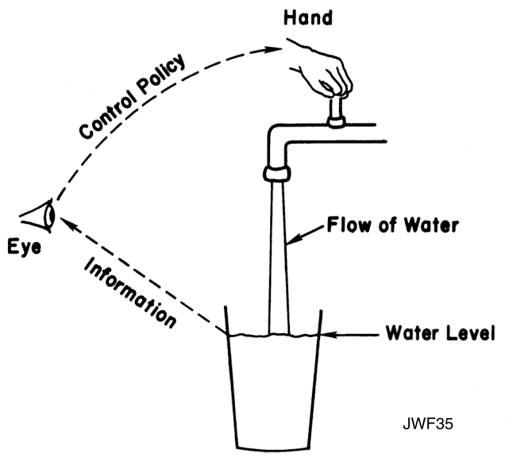
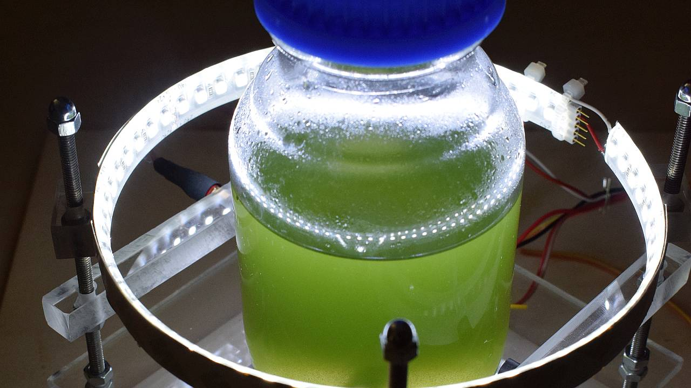
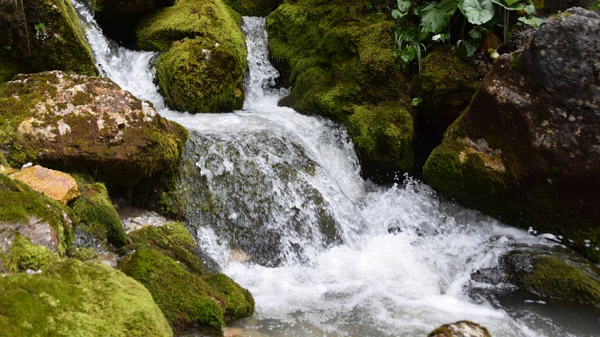
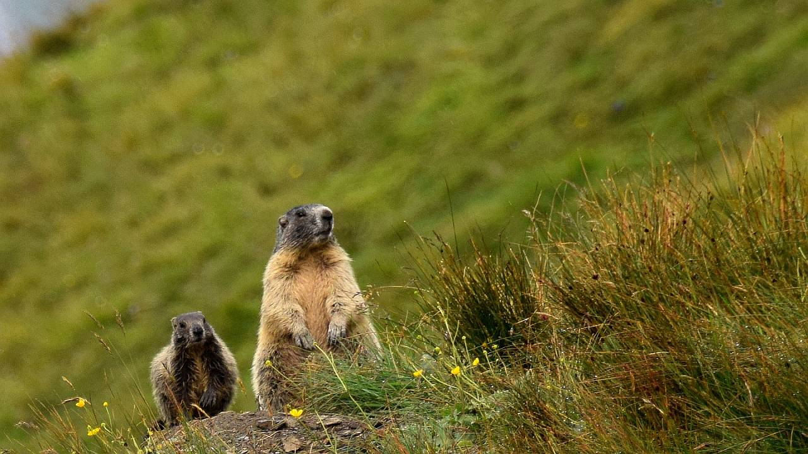
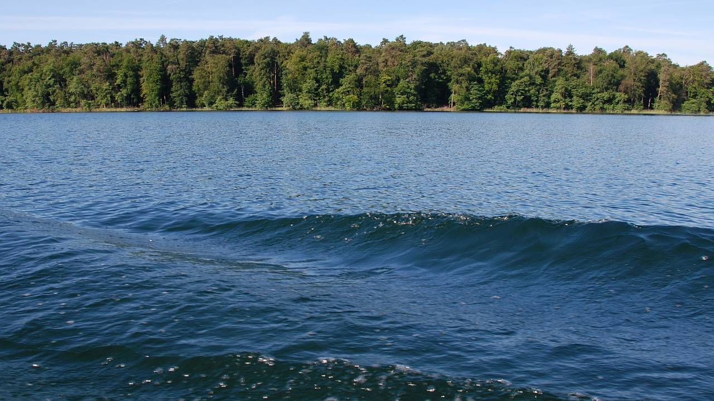
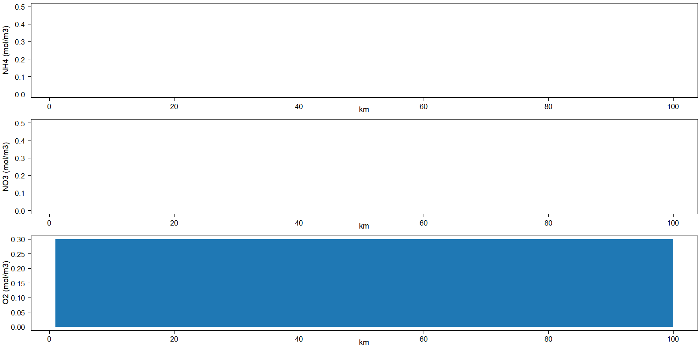
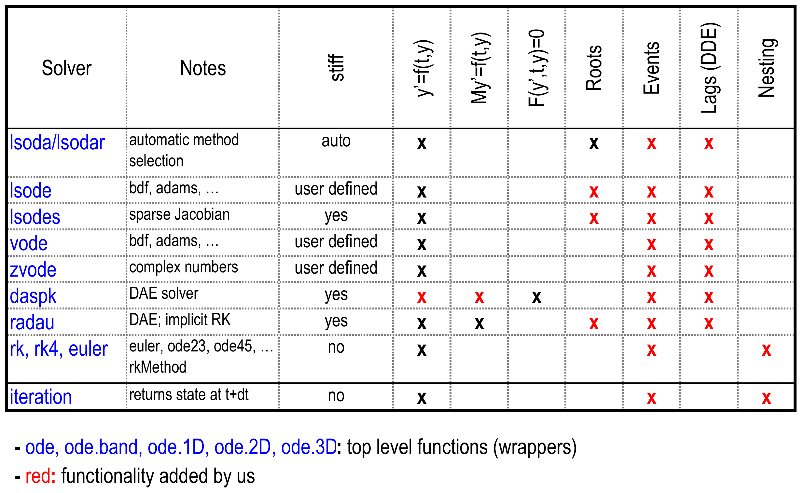

class: center, middle, title-slide

background-image: url("img/water_tud_nioz_r_oer_by.jpg")

background-size: cover


<!-- Own title slide / -->

# Numerical Simulation of Dynamic Systems With R: An Introduction

#### Thomas Petzoldt and Karline Soetaert


Contribution to the "Open Data and Open Science in the Aquatic Sciences" workshop<br>
https://aquaticdatasciopensci.github.io/
<br>
July 16th 2021.

.small[Version `r Sys.Date()`, source code freely available from [https://github.com/dynamic-R](https://github.com/dynamic-R/hacking-limnology)]

--- 

Use cursor keys for navigation, press .red["O"] for a slide .red[O]verview


```{r setup, include=FALSE}
knitr::opts_chunk$set(echo = FALSE, fig.width=14, 
                      fig.height=6, dev.args = list(pointsize=20))
library("dplyr")
library("tidyr")
library("kableExtra")
library("DiagrammeR")
library("deSolve")
library("rootSolve")
library("marelac")
mypar <- list(las = 1, cex.lab = 1.4, cex.axis=1.4, lwd = 2)
```

```{r xaringan-themer, include=FALSE, warning=FALSE}
library("xaringanthemer")
style_mono_light(
  title_slide_text_color = "#00305d",
  link_color = "#006ab2"#,
  #white_color = "#FFFFFF"
)
```

```{r xaringanExtra, include=FALSE, warnint=FALSE}
#library("xaringanExtra")
xaringanExtra::use_webcam()
xaringanExtra::use_tile_view()
#xaringanExtra::use_scribble()
#xaringanExtra::use_freezeframe()
#xaringanExtra::use_progress_bar(color = "#0051BA", location = "top")
```

<!-- citations work differently with xaringan compared to @Markdown / -->
```{r, load_refs, include=FALSE, cache=FALSE}
library("RefManageR")
BibOptions(check.entries = FALSE,
           bib.style = "authoryear",
           cite.style = "authoryear",
           style = "markdown",
           dashed = FALSE)
bib <- ReadBib("./bib.bib", check = FALSE)
```


---

## Summary


Dynamical systems are found everywhere, in mathematics, physics, chemistry, engineering and business - ecology and aquatic sciences are no exception.

One common approach to describe such systems is by means of differential equations. Following the ideas of Forrester, differential equations appear quite naturally if we describe changes in a system in terms of growth and decay, which together make up a mass balance. A somewhat bigger challenge is to solve these differential equations - some of us may still remember the challenges of differential calculus in high school courses.

Fortunately, computer algorithms allow to solve even complex differential equation systems numerically. This has opened a world of practical applications to be accessible for anyone that has a basic knowledge in scientific computing, or is willing to acquire this knowledge. R is such a scientific computing language that offers powerful methods to solve differential equations. Moreover, some R-packages are especially designed to also solve spatially variable problems that are often found of importance in aquatic sciences.

The introduction will demonstrate selected examples: growth of organisms, predator-prey interaction, spread of diseases, and transport-reaction problems. The formulation of such models in R can be surprisingly compact and close to the mathematical equations. 

---
class: center, middle, title-slide
background-image: url("img/water-light.jpg")

# Introduction


---
J.W. Forrester (1918-2016)

## Traditional linear thinking

<br>

.center[
```{r causal, echo=FALSE, fig.height=1.5}
grViz("digraph causal {
         graph [rankdir = 'LR', bgcolor='none']
           node [shape = box, penwidth=2, fontname = 'Helvetica']
             Information Action Result
           edge [penwidth=1.5]
             Information -> Action -> Result
}")
```
]


---
J.W. Forrester (1918-2016)

## Dynamic thinking: Feedback loops

<br>

.center[
```{r feedback1, echo=FALSE, fig.height=4}
grViz("digraph feedback1 {
         graph [rankdir = 'LR', bgcolor='none']
           node [shape = box, penwidth=2, fontname = 'Helvetica', minlen=3]
             Information Action Result
           edge [penwidth=1.5]
             Information -> Action -> Result
           edge [penwidth=0.7, tailport = 's', headport = 's', constraint = false, color=tomato, label='feedback']
             Result -> Information
           
}")
```
]


---

## Jay W. Forrester: System Dynamics


.pull-left[

]

.pull-right[

]

* flow of information, flow of matter
* thinking in feedback loops
* easy to understand, if we think in pools and changes

From: [Forrester, J.W. (2009) Some Basic Concepts in System Dynamics](https://web.mit.edu/sysdyn/sd-intro/D-4165-1.pdf)


---

## Dynamic Systems are Everywhere

.center[




]


---

## Example 1: Predator-Prey model


---

## Example 2: Nitrification in a River (1D)
.center[

]

---

## Example 3: Covid-19: Flatten the Curve!
.center[
<iframe src="https://weblab.hydro.tu-dresden.de/apps/sir-app/" width=800px, height=500px></iframe>
]
---

## Example 4: An Epidemiological Model in 2D

.center[

]

---
class: center, middle, title-slide
background-image: url("img/water-light.jpg")

# .darkblue[Description of Dynamic Systems]


---

## Common Properties of Dynamic Systems

.pull-left[

### State at a given time

- vector of real numbers
- point in state space
]


.pull-right[.page-font-huge[
$$\mathbf{y_t}$$
]]

--

.pull-left[

### Evolution rule

- function that describes <br> .red[what future states follow from the current state]
]

.pull-right[.page-font-huge[
$$\mathbf{y_t \rightarrow y_{t+1}}$$
]]

<br> <br>
.gray[*) Wikipedia, [Dynamical_system](https://en.wikipedia.org/wiki/Dynamical_system)]


---
class: page-font-large

## Different Ways of Description

.gray[
#### Statistical approach

* static, mass-balanced snapshot of the system, or
* time series of state variables (pools)
]
#### .blue[Dynamic approach]

* description of .green[changes]
* .green[deterministic] .gray[or stochastic]
* .gray[individual-based models]
* .gray[discrete time: difference equations]
* equations in .green[continuous time] $\rightarrow$ .green[differential equations] (ODEs)


---

class: scrollable-slide

## Differential Calculus

.pull-left[
.center[
$\dot{y} = k \cdot y$


Isaac Newton, 1643 - 1727
]]

.pull-right[
.center[
$\frac{dy}{dx} = k \cdot y$


Gottfried Wilhelm Leibniz, 1646 - 1716
]]

--- 
.center[
##### $\Rightarrow$ describes .red[changes] of pools
]

--- 
.small[.gray[
Newton: https://commons.wikimedia.org/wiki/File:IsaacNewton_1642-1727.jpg (CC-BY-SA 4.0) <br>
Leibniz: https://commons.wikimedia.org/wiki/File:Gottfried_Wilhelm_Leibniz,_Bernhard_Christoph_Francke.jpg (public domain)
]]

---
class: page-font-huge

## Dynamic systems: how and why?


"Many believe that system dynamics has helped them become skilled at
inventing the future, either by sketching out causal loops on the 
.green[back of an envelope], or by assembling equations of cause and effect in a
.green[computer model]. Both approaches work."

.small[.blue[(J. W. Forrester, 1995)]]
---
class: page-font-large

## Dynamic systems: how and why?


.pull-left[
#### Let’s speak about computers:


.center[

]
- continous time <br> $\rightarrow$ differential equations

- .gray[discrete time: <br> another interesting story ...]
]    

.pull-right[
#### Why numerical integration?
* Analytical solution<br> does not exist for all systems.

* Flexibility to simulate <br>time-dependent inputs.    

.small[.green["... students can deal with high-order dynamic systems
without ever discovering that their elders consider such to be very difficult."]
.gray[J. W. Forrester 2009]]
]

---
class: center, middle, title-slide

background-image: url("img/water-light.jpg")

# Differential Equation Systems in R


---
class: page-font-large

## Import and Export

\begin{align}
\frac{dN}{dt} = \mbox{import} - \mbox{export}\\
\end{align}

```{r diag-im-ex, echo=FALSE, fig.height=4}
grViz("digraph feedback {
         graph [rankdir = 'LR', bgcolor='none']
           node [shape = box, penwidth=2, fontname = 'Helvetica']
             N
           node [shape = octagon, penwidth=0.5, style='rounded', fixedsize=25, fontsize=8]
             Source Sink
           node [shape = none, fontsize=10]
             import export
           edge [penwidth=1.5]
             Source -> import -> N -> export -> Sink
         
}")
```

$N$ = .gray[any quantity: matter, energy, information], e.g. **N**umber of individuals

---

## Exponential Growth

\begin{align}
\frac{dN}{dt} &= \mbox{birth} - \mbox{death}\\
              & = \mbox{birthrate} \cdot N - \mbox{deathrate}\cdot N\\
              &= b \cdot N - d \cdot N = (b-d) \cdot N \\
\frac{dN}{dt} &= r \cdot N\\
\end{align}


```{r echo=FALSE, fig.height=4}
grViz("digraph feedback {
         graph [rankdir = 'LR', bgcolor='none']
           node [shape = box, penwidth=2, fontname = 'Helvetica']
             'Population N'
           node [shape = octagon, penwidth=0.5, style='rounded', fixedsize=25, fontsize=8]
             Source Sink
           node [shape = none, fontsize=10]
             birth death
           edge [penwidth=1.5]
             Source -> birth -> 'Population N' -> death -> Sink
           edge [penwidth=0.7, tailport = 'n', headport = 'n', constraint = false, color=tomato]
             'Population N' -> birth 
             'Population N' -> death
}")
```


---

## Analytical Integration


.pull-left[
```{r expgrowth, echo=FALSE, fig.height=4, fig.width=10}
par(mar=c(2.5, 5, 0.5, 1)+.1, las = 1, lwd = 2)
r    <- 0.5
N0   <- 10
dt   <- 0.1
time <- seq(0, 10, dt)
N <- N0 * exp(r * time)
plot(time, N, type="l", xlab="", ylim=c(0, 1500))
mtext("time", 1, 1.5)
```
```r
r    <- 0.5
N0   <- 10
dt   <- 0.1
time <- seq(0, 10, dt)

N <- N0 * exp(r * time)
plot(time, N, type="l")
```
]

.pull-right[
\begin{align}
\frac{dN}{dt} &= r\cdot N\\
\int_0^t \frac{dN}{dt} &= \int_0^t r\cdot N\\
\int_0^t \frac{1}{N} dN &= \int_0^t r dt\\
\ln(N) &= rt + c\\
N_t &= N_0 e^{rt}\\
\end{align}

<br></br>

* Integral calculus = "Gold Standard" ...
* ... but not always possible
]

---

## Numerical Integration with the Euler Method


.pull-left[

```{r expgrowth-euler, echo=FALSE, fig.height=4, fig.width=10}
par(mar=c(2.5, 5, 0.5, 1)+.1, las = 1, lwd = 2)
N <- numeric(length(time))

N[1] <- N0
for (i in 2:length(time)) {
  N[i] <- N[i-1] + r * N[i-1] * dt
}
plot(time, N, type = "l", lty="solid", col="red", xlab="", ylim=c(0, 1500))
N <- N0 * exp(r * time)
lines(time, N, lty="solid")
mtext("time", 1, 1.5)
legend("topleft", c("analytical", "Euler"), col=c("black", "red"), lty=1)
```


```{r echo=TRUE, eval=FALSE}
N <- numeric(length(time))

N[1] <- N0
for (i in 2:length(time)) {
  N[i] <- N[i-1] + r * N[i-1] * dt
}
plot(time, N, type = "l", col = "red")
```
]

.pull-right[
\begin{align}
\frac{dN}{dt} &= r\cdot N\\
\frac{\Delta N}{\Delta t} &= r\cdot N\\
N_t &= N_{t-1} + r\cdot N_{t-1} \cdot \Delta t
\end{align}

<br></br>

.page-font-large[
* .red[discrete time steps]
* approximate differential equation<br> by $\rightarrow$ difference equation
* easy, but integration error
]
]

---

## Numerical Integration Made Easy with deSolve

.pull-left[
#### Logistic growth

<span style="background: #ffff88;">
$\frac{dN}{dt} = rN(1-N/K)$
</span>


#### Code: close to mathematical notation

```{r ode-naive, eval=FALSE, echo=TRUE}
library("deSolve")
model <- function (time, y, parms) {
  with(as.list(c(y, parms)), {
   {{dN_dt <- r * N * (1 - N / K)}}
    list(c(dN_dt))
  })
}
y0 <- c(N = 0.1)
parms <- c(r = 0.1, K = 10)
times <- seq(from = 0, to = 100, by = 1)
```
]

.pull-right[
#### Solve with `ode`

```{r, echo=TRUE, eval=FALSE}
{{out <- ode(y0, times, model, parms)}}
plot(out)
```


```{r, ode-naive2, eval=TRUE, echo=FALSE, fig.width=10, fig.height=5.5}
par(las = 1, mar=c(2.5,3,1.5,1)+.1, lwd = 2)
library("deSolve")
model <- function (time, y, parms) {
  with(as.list(c(y, parms)), {
    dN_dt <- r * N * (1 - N / K)
    list(c(dN_dt))
  })
}
y0 <- c(N = 0.1)
parms <- c(r = 0.1, K = 10)
times <- seq(from = 0, to = 100, by = 1)
out <- ode(y0, times, model, parms)
plot(out, xlab="")
mtext("time", 1, 1.4)
```

* better performance, reduced integration error
]

---
## R Package deSolve

.pull-left[ 
#### Numerical solution of differential equations

* **initial value problems**, .gray[ODE, PDE, DAE, DDE]
* popular .green[industry class solvers] from ODEPACK<sup>1</sup><br>
  .gray[and classical Euler and Runge-Kutta solvers]
* .green[convenience tools] (e.g. `plot`, forcings, events) 
]


.pull-right[
#### Part of an "Ecosystem" for dynamical simulations

* packages: rootSolve, bvpSolve, FME, ReacTran, ...
* .green[compatible interfaces]
* See [CRAN Task View](https://cran.r-project.org/web/views/DifferentialEquations.html) for related packages
* .green[extensive documentation:] papers, books, websites,
[mailing list](https://stat.ethz.ch/mailman/listinfo/r-sig-dynamic-models), 
[StackOverflow](https://stackoverflow.com/search?tab=newest&q=%5br%5d%20desolve?ode)
]

.gray[
<br><br><br>
$^1$ Thanks to the great ODEPACK authors (ctb=contributors) who made their code publicly available:

Peter N. Brown [ctb] (files ddaspk.f, dvode.f, zvode.f), George D. Byrne [ctb] (files dvode.f, zvode.f), Ernst Hairer [ctb] (files radau5.f, radau5a), Alan C. Hindmarsh [ctb] (files ddaspk.f, dlsode.f, dvode.f, zvode.f, opdkmain.f, opdka1.f), Cleve Moler [ctb] (file dlinpck.f), Linda R. Petzold [ctb] (files ddaspk.f, dlsoda.f), Youcef Saad [ctb] (file dsparsk.f), Clement W. Ulrich [ctb] (file ddaspk.f)
]

---
class: page-font-large

## What is `ode`?

* **`ode`** is used to call one of the solvers
* then the solver calls the model function at adequate time steps
* the model function contains the **derivatives** of the system


## Solvers
* default: .red[**`lsoda`**]
* Livermore solver for Ordinary Differential Equations, automatic
* switches between stiff and non-stiff solver


... other solvers, fine-tuning and pitfalls, see [docs](https://cran.r-project.org/package=deSolve/)


---
## Automatic Step Size

.pull-left[
#### Internal time step size and output steps

Most solvers adapt integration steps automatically,<br> to maintain pre-defined precision.

User can specify tolerances **`atol`**, **`rtol`**, default: $10^{-6}$

Outputs collected at pre-specified time points.

#### Fixed-step solvers: `euler`, `rk2`, `rk4`

still quite popular, because easy to implement

$\rightarrow$ problems with precision, CPU effort, stability<br>
$\rightarrow$ useful in special cases

]

.pull-right[

```r
out <- ode(y0, 
* times = 1:10,    # output time steps
  model, 
  parms, 
  atol = 1e-6,     # absolute tolerance
  rtol = 1e-6      # relative tolerance
)
```

<br><br>
* use .red[**`lsoda`**]
* no need to use very small output steps
* keep tolerances in mind,<br> consider to rescale huge or tiny values
]

---
class: page-font-huge
background-image: url("img/water-light.jpg")

# Some Practical Examples

1. Resource limited growth

1. A basic Covid 19 model

1. Basic idea of a lake: the chemostat

1. Lotka-Volterra's predator-prey interactions

1. Reaction and transport in a river


---
background-image: url("img/batch.jpg")

## .bg-contrast[Example 1: Resource Limited Growth]


---
## Resource Limited Growth

<br>

```{r diag-resource-limited, echo=FALSE, eval=TRUE, fig.height=3}
library(DiagrammeR)

grViz("digraph feedback {
         graph [rankdir = 'LR', bgcolor='none']
           node [shape = box, penwidth=2, fontname = 'Helvetica']
             Nutrient, Algae
           node [shape = none, fontsize=10]
             growth
           edge [penwidth=1.5]
             Nutrient -> growth -> Algae 
           edge [penwidth=0.7, tailport = 'n', headport = 'n', constraint = false, color=tomato]
             Algae -> growth 
}")
```

* two state variables
* functional response: growth depends on nutrient, e.g. Holling, Monod, ...
* feedback: more algae, more growth

---


### System of equations

```{r diag-resource-limited, echo=FALSE, eval=TRUE, fig.height=2}
```

----

\begin{align}
\frac{d\mbox{Algae}}{dt} &=       & &r \cdot f(\mbox{Nutrient}) \cdot \mbox{Algae}\\
\\
\frac{d\mbox{Nutrient}}{dt} &=   &- & r \cdot f(\mbox{Nutrient}) \cdot  \mbox{Algae} \cdot \frac{1}{Y} 
\end{align}

with:

$$
f(\mbox{Nutrient}) =  \text{functional response, e.g. Holling I, II, III}
$$


---


## Resource Limited Growth

#### The Model

```{r, resource-limited, echo=TRUE, eval=TRUE}
model <- function (time, y, parms) {
  with(as.list(c(y, parms)), {
    f <- P/(kP + P)
    dAlg_dt <- r * f * Alg
    dP_dt   <- - r * 1/Y * f * Alg
    list(c(dAlg_dt, dP_dt))
  })
}
y <- c(
  Alg = 10,  # algae,      mol/m3 carbon
  P   =  5   # phosphorus, mol/m3 P
) # in mg/L
parms <- c(r = 0.1, kP = 0.5, Y = 106) # Y = C:P - Redfield ratio
```

#### Where do parameters come from?

* $r$, $k_P$ derived from lab experiments
* $Y$ first guess from stoichiometry

```{r, , echo=TRUE, eval=TRUE}
library("marelac")
redfield(1, species="P")
```

#### Simulate the Model


```{r , echo=TRUE, eval=TRUE, fig.height=5, fig.width=15}
out <- ode(y, times, model, parms)
plot(out, las = 1)
```

#### Compare Scenarios

```{r , echo=TRUE, eval=TRUE, fig.height=5, fig.width=15}
out1 <- ode(y, times, model, parms =  c(r = 0.2, kP = 0.5, Y = 106))
out2 <- ode(y, times, model, parms =  c(r = 0.1, kP = 1.0, Y = 120))

plot(out1, out2, las = 1)
legend("topright", legend=c("Scenario 1", "Scenario 2"), lty=1:2, col=1:2)
```


---
background-image: url("img/1280px-SARS-CoV-2-CDC-23312.jpg")

## .bg-contrast[Example 2: A Covid-19 Model]


---

## A standard SIR model

```{r diag-sir, echo=FALSE, fig.height=4}
grViz("digraph feedback {
         graph [rankdir = 'LR', bgcolor='none']
           node [shape = box, penwidth=2, fontname = 'Helvetica', style='filled', color='dodgerblue']
             S, I, R
           node [shape = none, fontsize=10, style='']
             infection, recovery, mortality
            node [shape = octagon, penwidth=0.5, style='rounded', fixedsize=25, fontsize=8]
             X
           edge [penwidth=1.5]
             S -> infection -> I
             I -> recovery -> R
             I -> mortality
             mortality -> X
}")
```

#### Total population is subdivided into 3 subpopulations

* $S$: susceptible, $I$: infected, $R$: recovered

This is the general scheme from which different modifications can be derived,
e.g. an additional state variable $E$ (SEIR model) of exposed, or of deceased individuals $X$ (SIRX). It is also possible to consider multiple groups of $S$, $I$, $R$, their spatial
distribution or influence of stochasticity.

---

### Equations describing spread of the disease:


\begin{align}
\frac{dS}{dt} &= -infection\\
\frac{dI}{dt} &= infection - recovery - mortality\\
\frac{dR}{dt} &= recovery
\end{align}

where 

\begin{align}
infection &= b \cdot I \cdot S\\
recovery  &= g \cdot I\\
mortality &= m \cdot I
\end{align}

| Name      | Value      | Description         | Unit                        |
| --------- | ---------- | ------------------- | --------------------------- |
| b         | 0.00000002 | infection parameter | $\mathrm{ind^{-1}~d^{-1}}$ |
| g         | 0.07       | recovery parameter  | $\mathrm{d^{-1}}$           |
| m         | 0.007      | mortality parameter | $\mathrm{d^{-1}}$           |


---

### Code

```{r SIR-solution, echo=TRUE, fig.width=16, fig.height=6}
SIR <- function(t, state, parameters) {
  with (as.list(c(state, parameters)), {
    infection <- b * S * I
    recovery  <- g * I
    mortality <- m * I

    dS_dt     <- -infection 
    dI_dt     <-  infection - recovery - mortality
    dR_dt     <-  recovery

    list(c(dS_dt, dI_dt, dR_dt),  # the time derivatives
         Population = S+I+R)      # extra output variable
  })
}

parms <- c(
  b = 0.00000002,    # [1/ind/d], infection parameter 
  g = 0.07,          # [1/d],     recovery rate of infected individuals
  m = 0.007          # [1/d],     mortality rate of infected individuals
)
y0 <- c(S = 11500000 - 1000, I = 1000, R = 0)
times <- seq(from = 0, to = 365, by = 1)   # time sequence, in days
out   <- ode(y = y0, times = times, func = SIR, parms = parms)
plot(out, las = 1, mfrow = c(1, 4))
```


---

## External Interventions

* Let's assume society implements social distancing **after** realizing exponential growth.
* Implementation makes use of .green[forcings].
* This allows to consider any time-dependent inputs.

```{r SIR-distancing, echo=TRUE, fig.width=16, fig.height=6}
SIR_distancing <- function(t, state, parameters) {
  with (as.list(c(state, parameters)), {
   {{contact <- f_contact(t)}}
    Infection <- contact * b * S * I
    Recovery  <- g * I
    Mortality <- m * I
    
    dS_dt     <- -Infection 
    dI_dt     <-  Infection - Recovery - Mortality
    dR_dt     <-  Recovery

    list(c(dS_dt, dI_dt, dR_dt),  # the time derivatives
         Population = S+I+R)      # extra output variable
  }) 
}

{{f_contact <- approxfun(x = c(0, 50,  51, 365), y = c(1,  1, 0.5, 0.5), rule = 2)}}

y0 <- c(S = 11500000 - 1000, I = 1000, R = 0)

parms <- c(
  b = 0.00000002,    # [1/ind/d], infection parameter 
  g = 0.07,          # [1/d],     recovery rate of infected individuals
  m = 0.007          # [1/d],     mortality rate of infected individuals
)


times <- seq(from = 0, to = 365, by = 1)   # time sequence, in days
out2   <- ode(y = y0, times = times, func = SIR_distancing, parms = parms)
plot(out, out2, las = 1, which = c("S", "I", "R"), mfrow = c(1, 4))
plot(times, rep(1, length(times)), 
     ylim = c(0,1), type="l", xlab = "time", ylab = "", 
     main = "social contact", las = 1, lty = 2)
lines(times, f_contact(times), lty = 2, col="red")
```


---
background-image: url("img/neunzehnhain.jpg")

## .bg-contrast[Example 3: A Lake with Inflow and Outflow]


---

## The Lake as a Bioreactor


* Consider a chemostat bioreactor as a basic model of a lake:
* Phosphorus (P) is delivered from a source with a constant *dilution* rate **D**.
* Algae (Alg) take up phosphorus and grow.
* Part of algae and remaing phosphorus are flushed away.


---

## A Chemostat with Algae and Phosphorus

\begin{align}
\frac{dAlg}{dt}  & = growth - export \\
\frac{dP}{dt}    & = (import - export) - 1/Y \cdot growth  
\\
\text{with:}\\
growth & = f(P)
\end{align}

--- 

\begin{align}
\frac{dAlg}{dt}  & = r \cdot Alg - D \cdot Alg\\
\frac{dP}{dt}    & =  D \cdot (P_0 - P) - 1/Y \cdot r \cdot Alg\\
\\
\text{with:}\\
r   & = r_{max} \cdot \frac{P}{kp + P}  \qquad\text{(Monod equation)}\\
\end{align}

---

## The Chemostat Code


```{r Chemostat-dynamic, echo=TRUE, fig.height=5, fig.width=15, dev.args=list(pointsize=20)}
library("deSolve")
library("rootSolve")

chemostat <- function(time, init, parms) {
  with(as.list(c(init, parms)), {
    r       <- r_max * P/(kp + P)  # Monod equation
    dAlg_dt <- r * Alg - D * Alg
    dP_dt   <- D * (P0 - P) - 1/Y * r * Alg
    list(c(dAlg_dt, dP_dt), r = r)
   })
}
parms <- c(
  r_max = 0.5,    # 1/d
  kp    = 0.5,    # half saturation constant, P (mol/m3)
  Y     = 106,    # yield coefficient (stoichiometric C:P ratio)
  D     = 0.1,    # 1/d
  P0    = 5       # P in inflow (mol/m3)
)
times <- seq(0, 40, 0.1)        # (d)
init  <- c(Alg = 10, P = 5)    # Phytoplankton C and Phosphorus P (mol/m3)

## =============================================================================
## Dynamic simulation
## =============================================================================
out <- ode(init, times, chemostat, parms)
plot(out, mfrow=c(1, 3), las = 1)
```

---

### Equilibrium

#### Steady state solution

```{r chemostat-equilibrium, echo=TRUE, fig.height=12, fig.width=15}
state <- data.frame(
  D = seq(0, 0.6, length.out = 100),
  X = 0,
  S = 0
)

for (i in 1:nrow(state)) {
  parms["D"] <- state$D[i]
  times <- c(0, Inf)
  out <- runsteady(init, times, chemostat, parms)
  state[i, 2:3] <- out$y
}

par(mfrow = c(3, 1))
plot(S ~ D, data = state, type = "l")
plot(X ~ D, data = state, type = "l")
plot(S * X ~ D, data = state, type = "l")
```


**Note:** this can also be solved analytically.


---
background-image: url("img/marmots.jpg")

## .bg-contrast[Example 4: Predator-Prey Model]


---

## Interaction Between Populations

### Lotka-Volterra's Predator and Prey

```{r diag-LV, echo=FALSE, fig.height=4}
grViz("digraph lotka {
         graph [rankdir = 'LR', bgcolor='none']
           node [shape = box, penwidth=2, fontname = 'Helvetica']
             Predator, Prey
           node [shape = octagon, penwidth=0.5, style='rounded', fixedsize=25, fontsize=8]
             Source Sink
           node [shape = none, fontsize=10]
             growth death grazing
           edge [penwidth=1.5]
             Source -> growth -> Prey -> grazing -> Predator -> death -> Sink
           edge [penwidth=0.7, tailport = 'n', headport = 'n', constraint = false, color=tomato]
             Prey -> growth
             Predator -> grazing
           edge [penwidth=0.7, tailport = 's', headport = 's', constraint = false, color=tomato]
             Prey -> grazing
             Predator -> death

}")
```

* state diagram, cycles
* damped cycle if we introduce a Monod term


---

### Lotka-Volterra Model

```{r diag-LV, echo=FALSE, fig.height=2}
```

\begin{align}
\frac{dPrey}{dt} &= \mbox{growth} - \mbox{grazing}\\
\\
\frac{dPred}{dt} &= g \cdot \mbox{grazing} - \mbox{mortality}
\end{align}

With:

\begin{align}
\mbox{growth}    & = a \cdot Prey & \qquad \text{(exponential growth)}\\
\mbox{grazing}   & = b \cdot Prey \cdot Pred & \qquad \text{(interaction)}\\
\mbox{mortality} & = -e \cdot Pred & \qquad \text{(exponential decay)}\\
                 &  g              & \text{(grazing efficiency)}
\end{align}

---

### Lotka-Volterra Model: Implementation

```{r, LV-basic, echo=TRUE, fig.height=4, fig.width=15}
require(deSolve)   
y0    <- c(Prey=300, Pred=10)                       # state variable initial conditions
parms <- c(a=0.05, K=500, b=0.0002, g=0.8, e=0.03)  # parameter values

LV <- function(t, state, parameters) { 
  with (as.list(c(state, parameters)), {
    growth     <- a * Prey
    grazing    <- b * Prey * Pred
    mortality  <- e * Pred
    dPrey_dt <- growth - grazing
    dPred_dt <- g * grazing - mortality
    return (list(c(dPrey_dt, dPred_dt),  # vector of derivatives
                 sum = Prey + Pred))     # output variable
  })
}
times <- 1:1000
out   <- ode(y = y0, func = LV, times = times, parms = parms)
plot(out, mfrow = c(1, 3), las = 1)
```


---

## Efficient Model Formulation in Matrix Style

#### Two preys and two preadors $\rightarrow$ 4 equations
```{r, echo=TRUE}
model <- function(t, n, parms) {
  with(as.list(c(n, parms)), {
    dN1_dt <-  r1 * N1      - a13 * N1 * N3  # Prey1
    dN2_dt <-  r2 * N2      - a24 * N2 * N4  # Prey2
    dN3_dt <- a13 * N1 * N3 -  r3 * N3       # Predator1
    dN4_dt <- a24 * N2 * N4 -  r4 * N4       # Predator2
    return(list(c(dN1_dt, dN2_dt, dN3_dt, dN4_dt)))
  })
}

times <- seq(from=0, to=500, by = 0.1)
n0    <- c(N1=1, N2=1, N3=2, N4=2)            # Number of individuals
parms <- c(r1 = 0.1, r2=0.1, r3=0.1, r4=0.1,  # net growth = birth - death
          a13=0.2, a24 = 0.1                  # interaction
)

out <- ode(n0, times, model, parms)
```

#### Matrix formulation: appears as one single equation

```{r, echo=TRUE, fig.height=8, fig.width=15}
model <- function(t, N, parms) {
  with(parms, {
   {{dN_dt <- r * N  + N * (A %*% N)}}
    return(list(dN_dt))
  })
}

parms <- list(
  r = c(r1 = 0.1, r2 = 0.1, r3 = -0.1, r4 = -0.1),
  ## pairwise interactions:
  A = matrix(c(0.0, 0.0, -0.2,  0.0,    # prey 1
               0.0, 0.0,  0.0, -0.1,    # prey 2
               0.2, 0.0,  0.0,  0.0,    # predator 1; eats prey 1
               0.0, 0.1,  0.0,  0.0),   # predator 2; eats prey 2
               nrow = 4, ncol = 4, byrow = TRUE)
)

out <- ode(n0, times, model, parms)
plot(out, las = 1)
```

---
background-color: #00305d
background-image: url("img/polluted-river3.jpg")

## .orange[Example 5:<br> Reaction<br> and Transport<br> in a<br> Polluted River]


---

## PDE's in 1D: Transport in a River

* A 1D river model has in fact two dimensions, time and space.
* The model has derivatives in both dimensions, so we get partial differential equations (PDE).
* Different methods exist to solve such systems -- **deSolve** supports the **method of lines**:
    * space is discretisized into fixed grid cells
    * time is handled by standard ODE solvers with variable time step
    * functions `ode.1D`, `ode.2D` and `ode.3D` provide pre-defined Jacobi matrices
* Transport with own matrix functions or with **R** package **ReacTran**
* System of equations for all grid cells forms a state vector with, e.g. several 1000 equations,
that are then solved quasiparallel by the solver.


Fast solvers + efficient estimation the Jacobians + R's vectorization<br> make multidimensional models surprinsingly fast.

---

## Example: Nitrification in a River

<br><br>

.page-font-large[
$$\mathrm{NH_4^+ + 2 O_2 \longrightarrow NO_3^- + H_2O + 2H^+}$$
]

--

```{r diag-river_1d, echo=FALSE, fig.height=3}
grViz("digraph river_1d {
         graph [rankdir = 'LR', bgcolor='none']
           node [shape = box, penwidth=2, fontname = 'Helvetica']
             O2, NH4, NO3
           node [shape = octagon, penwidth=0.5, style='rounded', fixedsize=25, fontsize=8]
             Source
           node [shape = none, fontsize=10]
             nitrification aeration
           edge [penwidth=1.5]
             Source -> aeration -> O2
             NH4 -> nitrification
             O2 -> nitrification

             nitrification -> NO3
           edge [penwidth=0.7, tailport = 's', headport = 's', constraint = false, color=tomato]
             O2 -> aeration
}")
```

---

## Model in 0D: Batch

```{r, river0d, echo=TRUE, fig.height=4, fig.width=15}
parms <- c(
  r_nitri = 2.0,   # 1/day   nitrification rate
  kO2     = 0.001, # mol/m3  half sat. constant
  k2      = 2.8,   # 1/day  re-aeration rate
  O2sat   = 0.3    # mol/m3 saturation concentration
)

Nitrification <- function(t, y, parms) {
  with(as.list(c(y, parms)), {

    aeration      <- k2 * (O2sat - O2)
    nitrification <- r_nitri * O2/(O2 + kO2) * NH4

    dNH4 <- -nitrification
    dNO3 <- +nitrification
    dO2  <-  aeration - 2 * nitrification
    list(c(dNH4, dNO3, dO2))
  })
}

y0 <- c(NH4 = 0.5, NO3 = 0, O2 = 0.3) # in mol/m3

times <- seq(from = 0, to = 5, length.out=101)

out <- ode(y=y0, times = times, func=Nitrification, parms = parms)
plot(out, mfrow=c(1, 3), lwd = 2, las = 1, ylab="mol/m3")
```


---

## River Geometry


```{r diag-river_nh4, echo=FALSE, fig.height=4}
grViz("digraph river_nh4 {
         graph [rankdir = 'LR', bgcolor='none']
           node [shape = box, penwidth=1.5, width=0.25, fontname = 'Helvetica', fontsize=16]
           1 2 3 4 5 6 7  N
           node [shape = none]
           up '...' down
           edge [penwidth=1.2, len=1]
           up -> 1 -> 2 -> 3 -> 4 -> 5 -> 6 -> 7  -> '...' -> N -> down
     
}")
```


* 100km river stretch, 100 grid cells, each 1km
* upper and lower boundary conditions for all substances
* for simplicity: constant river geometry, flow velocity and rate parameters

---

## Implementation of River Geometry and Transport

```{r river-1d-code, echo=TRUE, eval=FALSE}
library("ReacTran")
Nitrification <- function(t, y, parameters) {
  with(as.list(c(parameters)),{
    NH4 <- y[1:N]
    NO3 <- y[(N+1):(2*N)]
    O2  <- y[(2*N+1):(3*N)]

    aeration      <- k2 * (O2sat - O2)
    nitrification <- r_nitri * O2/(O2 + kO2) * NH4

    dNH4 <- -nitrification +
      tran.1D(C = NH4, D = D, v = v, C.up = NH4up, C.down = NH4dwn, A = A, dx = Grid)$dC

    dNO3 <- +nitrification +
      tran.1D(C = NO3, D = D, v = v, C.up = NO3up, C.down = NO3dwn, A = A, dx = Grid)$dC

    dO2  <-  aeration - 2 * nitrification +
      tran.1D(C = O2 , D = D, v = v, C.up = O2up,  C.down = O2dwn,  A = A, dx = Grid)$dC

    list(c(dNH4, dNO3, dO2))
  })
}
```

* `N` grid cells
* state vector: $\mathrm{NH4_{1..100}, NO3_{101..200}, O2_{201..300}}$
* upper and lower boundary conditions
* river transect area `A` 
* longitudinal Diffusion `D`
* grid cell length `dx`

---

## Full Source Code .gray[(with source code for animations)]

```{r river-1d-full, eval=FALSE, echo=TRUE}
library("ReacTran")
library("deSolve")
library("rootSolve")
library("gifski")

## Measurement units used
# Time   = day
# Mass   = mol
# Space  = m
# Volume = m3

N    <- 100  # number of grid cells
cell <- 1000 # 1000m = 1km / grid cell
Grid <- setup.grid.1D(N = N, L = N * cell)

#=============================================================================
# Model parameters
#=============================================================================

## river characteristics
v  <- 40000       # m/day
w  <- 15          # m
h0 <- 0.35        # m
A  <- w * h0      # m2

parameters <- c(
  r_nitri       = 2.0,   # 1/day   nitrification rate
  kO2           = 0.001, # mol/m3  half sat. constant
  NH4up         = 0.5,   # mol/m3  upper boundary
  NO3up         = 0.0,   # mol/m3  -- " --
  O2up          = 0.3,   # mol/m3  -- " --
  NH4dwn        = 0.0,   # mol/m3  lower boundary
  NO3dwn        = 0.0,   # mol/m3  -- " --
  O2dwn         = 0.3,   # mol/m3  -- " --
  D             = 100,   # m2/day dispersion coefficient
  k2            = 2.8,   # 1/day  re-aeration rate
  O2sat         = 0.3    # mol/m3 saturation concentration
)

#------------------------------------------------------------------------------
# Model definition:
#------------------------------------------------------------------------------

Nitrification <- function(t, y, parameters) {
  with(as.list(c(parameters)),{
    NH4 <- y[1:N]
    NO3 <- y[(N+1):(2*N)]
    O2  <- y[(2*N+1):(3*N)]

    aeration      <- k2 * (O2sat - O2)
    nitrification <- r_nitri * O2/(O2 + kO2) * NH4

    dNH4 <- -nitrification +
      tran.1D(C = NH4, D = D, v = v, C.up = NH4up, C.down = NH4dwn, A = A, dx = Grid)$dC

    dNO3 <- +nitrification +
      tran.1D(C = NO3, D = D, v = v, C.up = NO3up, C.down = NO3dwn, A = A, dx = Grid)$dC

    dO2  <-  aeration - 2 * nitrification +
      tran.1D(C = O2 , D = D, v = v, C.up = O2up,  C.down = O2dwn,  A = A, dx = Grid)$dC

    list(c(dNH4, dNO3, dO2))
  })
}

#=============================================================================
# Steady-state solution
#=============================================================================

std <- steady.1D(y = runif(3*Grid$N), names=c("NH4", "NO3", "O2"),
   func = Nitrification, parms = parameters, nspec = 3, pos = TRUE)

plot(std, mfrow = c(3, 1), las=1, xlab="km", ylab="mol/m3")

#=============================================================================
# Dynamic solution
#=============================================================================

# State variables and initial conditions
NH4_0  <- 0.0 # mol/m3
NO3_0  <- 0.0 # mol/m3
O2_0   <- 0.3 # mol/m3

state <- c(rep(NH4_0, N), rep(NO3_0, N), rep(O2_0, N))

# Time sequence
time_seq <- seq(from = 0, to = 5, length.out=101)

out1D  <- ode.1D(y=state, times=time_seq, func=Nitrification, parms=parameters, nspec=3)
image(out1D, xlab = "time, days", ylab = "Distance, m", grid= Grid$x.mid,
      main =c("NH4","NO3","O2"), add.contour=TRUE, mfrow = c(1, 3))

#=============================================================================
# Animated figure
#=============================================================================
plot_poly <- function(data, time) {
  poly <- function(x, y, pcol, ylab, ylim) {
    plot(x, y, type="n", las=1, xlab="", ylab="", ylim=ylim)
    polygon(x, y, col=pcol, lty="blank")
    mtext(side=1, line=1.5, text="km")
    mtext(side=2, line=3.5, text=ylab, las=3)

  }
  y <- data[time,-1]
  NH4 <- y[1:N]
  NO3 <- y[(N+1):(2*N)]
  O2  <- y[(2*N+1):(3*N)]
  x   <- c(1, 1:N, N)

  poly(x, c(0, NH4, 0), ylim=c(0, 0.5), pcol="#a6cee3", ylab="NH4 (mol/m3)")
  poly(x, c(0, NO3, 0), ylim=c(0, 0.5), pcol="#b2df8a", ylab="NO3 (mol/m3)")
  poly(x, c(0,  O2, 0), ylim=c(0, 0.3), pcol="#1f78b4", ylab="O2 (mol/m3)")
}

for (tt in 1:length(time_seq))  {
  png(paste0("river", 1000 + tt, ".png"), width=1600, height=800, pointsize = 18)
  par(mfrow=c(3,1))
  par(mar=c(3,5,.5,0), las=1, cex.axis=1.4, cex.lab=1.4, cex.main=2)
  plot_poly(out1D, tt)
  dev.off()
}
gifski(dir(pattern="^river.*png$"), gif_file = "river.gif", width=1600, height=800, delay=1/25)
```


---

### Nitrification in a River (1D): Result
.center[

]


---
class: middle, title-slide, page-font-large
background-image: url("img/water_tud_nioz_r_oer_by.jpg")
background-size: cover

# Conclusions

* User-contributed packages for **R** to solve differential equations numerically

* Easy to step in ...

* ... supports also complex applications.

* Part of a comprehensive "package ecosystem".


---
background-image: url("img/outlook.jpg")

# .bg-contrast[Outlook]


---

## Further reading ...

The details are described in the package vignettes of [deSolve](https://CRAN.R-project.org/package=deSolve) and [ReacTran](https://CRAN.R-project.org/package=ReacTran) 
and in the following papers: 
`r Citet(bib, "Soetaert2010b")`, 
`r Citet(bib, "Soetaert2010_rjournal")`, 
`r Citet(bib, "ReacTran")` and books: 
`r Citet(bib, "Soetaert2008")`, 
`r Citet(bib, "Soetaert2012")`.

The package relies on the source code and publications of the original algorithms, especially:
`r Citet(bib, "Hindmarsh1983")`, 
`r Citet(bib, "Petzold1983")`, 
`r Citet(bib, "Cash1990")`, 
`r Citet(bib, "Hairer2009")` and 
`r Citet(bib, "Hairer2010")`.

### Online Resources

* The CRAN Task View [Differential Equations](https://cran.r-project.org/web/views/DifferentialEquations.html) gives an overview over other packages with differential equation solvers and related tools.

* The [deSolve development page](https://desolve.r-forge.r-project.org) contains links to more detailed tutorials, books and papers.


A bunch of free docs and examples can be found in the internet, just search for `deSolve` and `R`.

---
class: center, middle, title-slide
background-image: url("img/water-light.jpg")

## Check out our github repos at:

# https://github.com/dynamic-R


## and thanks for watching.

---

## Copyright


This resource was created by [tpetzoldt](github.com/tpetzoldt) and 
[karlines](https://github.com/karlines). It is provided 
as is without warranty.

If not otherwise stated, images are own photos and drawings.

The original drawings of `r Citet(bib, "Forrester1990")` are cited, the [Newton](https://commons.wikimedia.org/wiki/File:IsaacNewton_1642-1727.jpg) (CC-BY-SA 4.0), 
[Leibniz](https://commons.wikimedia.org/wiki/File:Gottfried_Wilhelm_Leibniz,_Bernhard_Christoph_Francke.jpg) (public domain)
and 
[SARS-CoV-2](https://commons.wikimedia.org/wiki/File:SARS-CoV-2-CDC-23312.png) (public domain)
images were provided by Wikimedia Commons under a creative commons license. 
Please follow the link for details.


---

## Bibliography


```{r refs, echo=FALSE, results="asis"}
PrintBibliography(bib)
```


---

## Appendix


Things that should be mentioned somewhere, but not yet in the introductory
lecture

* Solver functions in deSolve
* C and Fortran interface

---

## Performance

Performance varies, depending on the type of the model. In general, simulation
can be fast if models can be written as matrices.

In case the performance appears as too slow, models can be written in **C** or 
**Fortran**. In such cases, control is transferred from R to compiled code and both
the solver and the model communicate directly. The interface is described in the [Compiled Code Package Vignette](https://cran.r-project.org/web/packages/deSolve/vignettes/compiledCode.pdf).

In addition, several third parpy packages exist that allow on-the-fly code 
generation from within R, especially 
package [cOde](https://CRAN.R-project.org/package=cOde), 
package [rodeo](https://github.com/dkneis/rodeo) and 
package [odin](https://mrc-ide.github.io/odin/).


---

## Solver Overview


