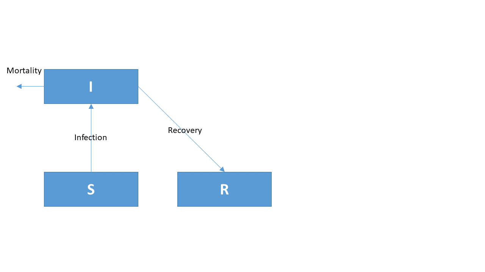

```{r setup, include=FALSE}
knitr::opts_chunk$set(echo = TRUE)
library(learnr)
```

## Tutorial

You are advised to watch the following video first 


for an implementation of a COVID model in R.

## Simple R model: Lotka-Volterra dynamics

The following R-code implements the Lotka-Volterra model whose dynamics are given by:


$$ \frac{{dX}}{{dt}} = a \cdot X \cdot (1 - \frac{X}{K}) - b \cdot X \cdot Y$$
$$     \frac{{dY}}{{dt}} = g \cdot b \cdot X \cdot Y - e \cdot Y$$

* With initial values: *X = 300*, *Y = 10* 
* and parameter values: *a = 0.05*, *K = 500*, *b = 0.0002*, *g = 0.8*, *e = 0.03*.
*	The model is run for 100 days, with daily output.

```{r LV-setup_, echo = TRUE, fig.height=4, fig.width=8, message = FALSE}
require(deSolve)   # package with solution methods

state.ini <- c(X=300, Y=10)            # state variable initial conditions
parms     <- c(a=0.05, K=500, b=0.0002, g=0.8, e=0.03)  # parameter values

LVmodel <- function(t, state, parameters) { 
  with (as.list(c(state, parameters)), {

    Growth.X     <- a*X*(1-X/K)
    Grazing.Y    <- b*X*Y
    Mortality.Y  <- e*Y
    
    dX.dt <- Growth.X  - Grazing.Y
    dY.dt <- g*Grazing.Y - Mortality.Y

    return (list(c(dX.dt, dY.dt),  # vector of derivatives
                 sum = X+Y))       # output variable
  })
}
times <- 1:100
out   <- ode(y = state.ini, func = LVmodel, times = times, parms = parms)
plot(out, mfrow = c(1,3))
```

*	Now run the model with other initial values (*X = 200*, *Y = 50*); call the output *out2*. 

Plot the two runs simultaneously. Tip: *plot(out, out2)* will plot all variables at once for both runs.

```{r LV, exercise=TRUE, fig.height=4, fig.width=8}
## run model with new initial values, and plot both runs at once
```

```{r LV-hint, fig.height=4, fig.width=6}
state.ini2 <- NA       # new initial conditions
out2   <- ode(...) # run model, with new initial conditions
plot(out, out2, mfrow = c(1,3))    # plot both runs at once
```

```{r LV-solution, fig.height=4, fig.width=6}
state.ini2 <- c(X = 200, Y = 50) 
out2   <- ode(y = state.ini2, func = LVmodel, times = times, parms = parms)
plot(out, out2, mfrow = c(1,3))
```

## Adding a state variable

Now change the lotka-volterra model by adding an extra state variable. You can use the 2-state-variable LV model to start with.

* Add a new state variable called "Z". Initial conditions for Z are the same as for Y.
* The dynamics for the Z variable are similar to the dynamics of Y, except for the parameters b and e that are  b = 0.0001 and 0.01 respectively - you will need to augment the parms vector with these new parameters (call them bz = 0.0001, ez = 0.01).

```{r LV2, exercise=TRUE, fig.height=6, fig.width=8}
## Extend the current model with state variable Z (similar dynamics as Y)
state.ini <- c(X=300, Y=10)            
parms     <- c(a=0.05, K=500, b=0.0002, g=0.8, e=0.03)  

LVmodel <- function(t, state, parameters) { 
  with (as.list(c(state, parameters)), {

    Growth.X     <- a*X*(1-X/K)
    Grazing.Y    <- b*X*Y
    Mortality.Y  <- e*Y
    
    dX.dt <- Growth.X  - Grazing.Y
    dY.dt <- g*Grazing.Y - Mortality.Y

    return (list(c(dX.dt, dY.dt),  # vector of derivatives
                 sum = X+Y))       # output variable
  })
}
times <- 1:100
out   <- ode(y = state.ini, func = LVmodel, times = times, parms = parms)
plot(out, mfrow = c(1,3))
```

```{r LV2-solution}
state.ini <- c(X = 300, Y = 10, Z = 10) 
parms <- c(a = 0.05, K = 500, b = 0.0002, g = 0.8, e = 0.03, bz = 0.0001, ez = 0.01)

LVmodel3 <- function(t, state, parameters) {
  with (as.list(c(state, parameters)), {
    Growth.X     <- a*X*(1-X/K)
    Grazing      <- b*X*Y
    Grazing.Z    <- bz*X*Z
    Mortality.Y  <- e*Y
    Mortality.Z  <- e*Z
    
    dX.dt <- Growth.X  - Grazing - Grazing.Z
    dY.dt <- g*Grazing   - Mortality.Y
    dZ.dt <- g*Grazing.Z - Mortality.Z

    return (list(c(dX.dt, dY.dt, dZ.dt), sum = X+Y+Z))
  })
}
times <- 1:100
out   <- ode(y = state.ini, func = LVmodel3, times = times, parms = parms)
plot(out)
```

## SIR model

The models used to investigate the spread of infectious diseases are called S.I.R. models. They describe the number of **S**usceptible, **I**nfected and **R**ecovered individuals in a population. Susceptible individuals are vulnerable to get the disease but are not (yet) infected. Infected individuals can recover, but some will die from the disease. Recovered individuals, at least initially, cannot become infected anymore.

{width=50%}

The equations describing the spread of the disease are:
$$\frac{dS}{dt} = -Infection,\\
\frac{dI}{dt} = Infection - Recovery - Mortality,\\
\frac{dR}{dt} = Recovery.$$
where 
$$Infection = b \cdot I \cdot S.\\
Recovery = g \cdot I,\\
Mortality = m \cdot I,$$

| Name      | Value      | Description         | Unit              |
| --------- | ---------- | ------------------- | ----------------- |
| b         | 0.00000002 | infection parameter | $ind^{-1}~d^{-1}$ |
| g         | 0.07       | recovery parameter  | $d^{-1}$          |
| m         | 0.007      | mortality parameter | $d^{-1}$          |

Below is the skeleton of a SIR model - expand it to describe the pandemic. Run the model for 365 days, 

Apply the model to the Belgian situation. You can start the simulation assuming that all Belgian people are susceptible to the disease, and that the spreading of the disease starts with 1000 infected individuals that return from holidays. There are 11.5 million Belgians. Also calculate the total population.


```{r SIR, exercise=TRUE, fig.height=6, fig.width=6}
require(deSolve)

state.ini <- c(S = , I = , R = ) # state variable initial conditions
parms     <- c(b = , g = , m = ) # parameters

SIRmodel <- function(t, state, parameters) {
  with (as.list(c(state, parameters)), {

    return (list(c(dS.dt, dI.dt, dR.dt),
                   Population = ))
  })
}
times <- 1:365
out   <- ode(y = state.ini, func = SIRmodel, times = times, parms = parms)
plot(out)
```

```{r SIR-hint}
SIRmodel <- function(t, state, parameters) {
  with (as.list(c(state, parameters)), {

    Infection <- b*I*S
    Recovery  <- 
    Mortality <-  
      
    dS.dt <- -Infection 
    dI.dt <- 
    dR.dt <- 

    return (list(c(dS.dt, dI.dt, dR.dt), # derivative vector
                 Population = S+I+R))
  })
}

```

```{r SIR-solution, fig.height=6, fig.width=6}
state.ini   <- c(S = 11500000-1000, I = 1000, R = 0, Deceased = 0)

parms       <- c(
  b = 0.00000002,    # [1/ind/d], infection parameter 
  g = 0.07,          # [1/d],     recovery rate of infected individuals
  m = 0.007          # [1/d],     mortality rate of infected individuals
)

SIRmodel <- function(t, state, parameters) {
  with (as.list(c(state, parameters)), {

    Infection  <- b*S*I
    Recovery   <- g*I
    Mortality  <- m*I
    
    dS.dt      <- -Infection 
    dI.dt      <-  Infection - Recovery - Mortality
    dR.dt      <-  Recovery

    return (list(c(dS.dt, dI.dt, dR.dt), # the time derivatives
                 Population = S+I+R))    # extra output variable
  }) 
}
time.seq <- seq(from=0, to=365, by=1)   # time sequence, in days
out      <- ode(y=state.ini, times=time.seq, func=SIRmodel, parms=parms)
plot(out, las=1, col=1:2, lty=1)
```

## Finally

```{r feedback, echo = FALSE}
question("give your feedback ", type = "learnr_text", answer(" ", correct=TRUE), correct="thank you", incorrect = "thank you")
```

